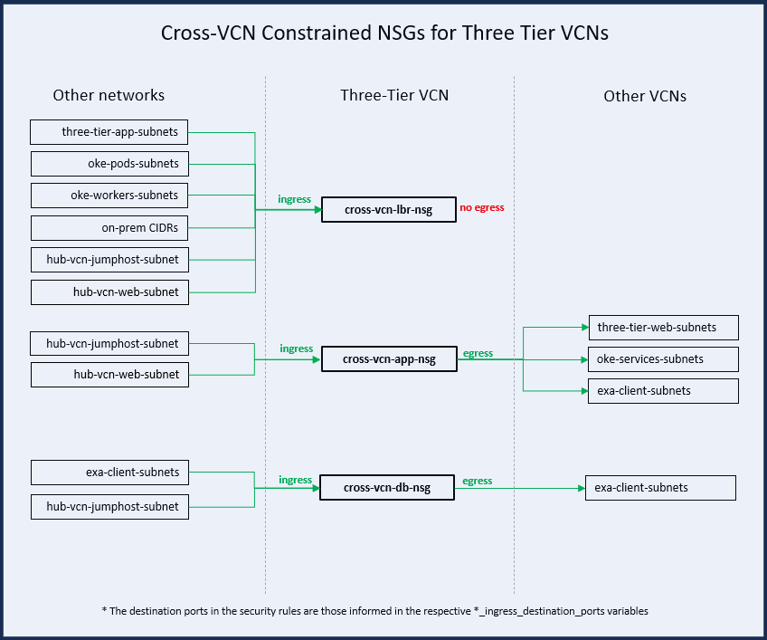
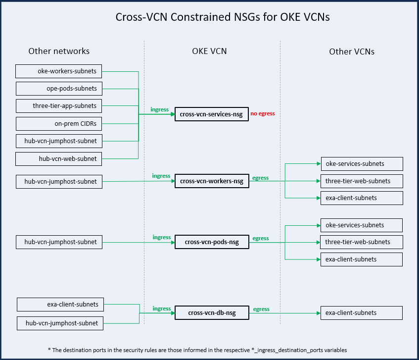
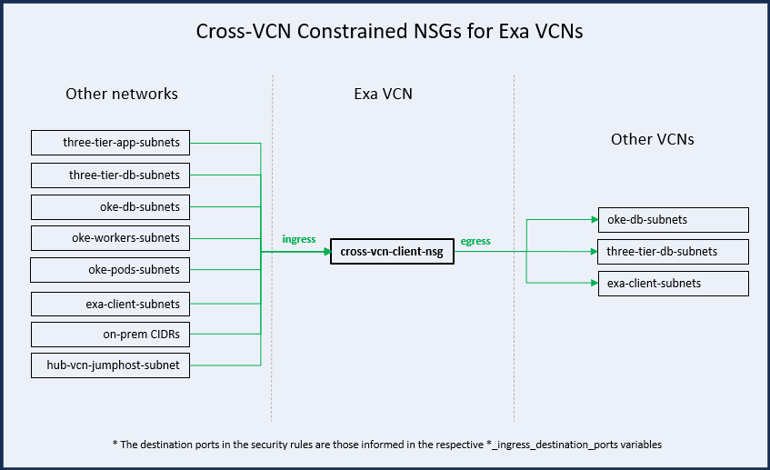
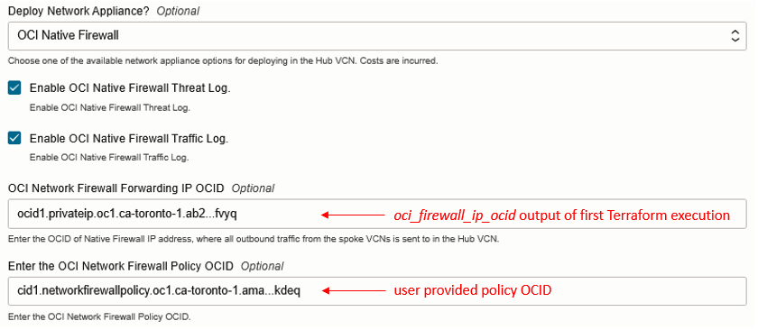
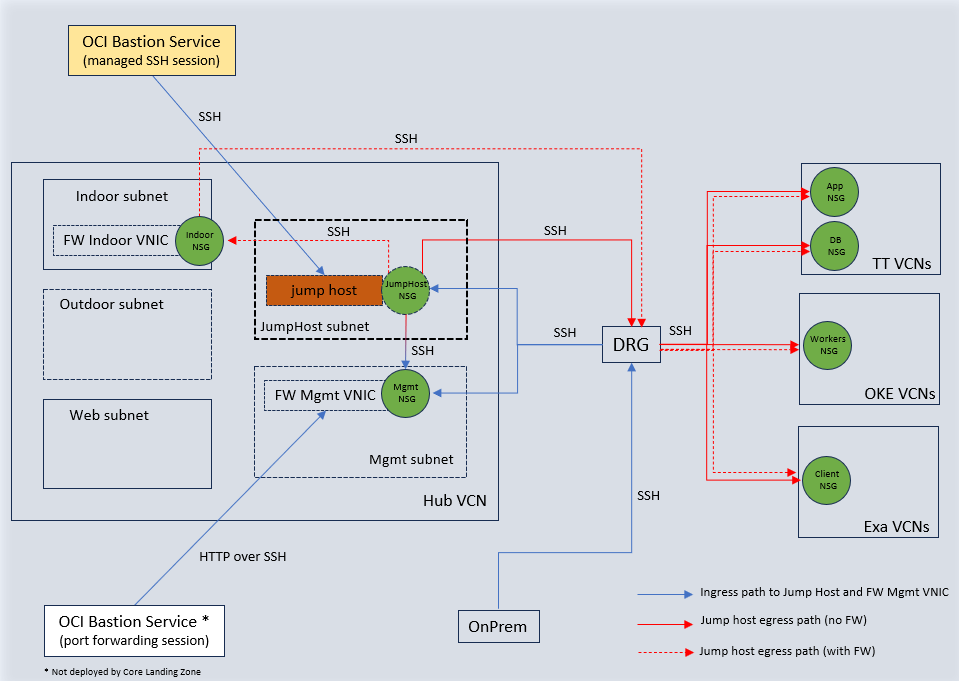

# Table of Contents

1. [Introduction](#introduction)
1. [Considerations](#considerations)
    1. [Access Permissions](#access-permissions)
    1. [Green Field and Brown Field Deployments](#green-field-and-brown-field-deployments)
    1. [Networking](#networking-2)
    1. [Managing State](#managing-state)
1. [Architecture](#architecture)
    1. [Identity & Access Management (IAM) Configuration](#iam-configuration)
    1. [Network Configuration](#network-configuration)
    1. [Governance](#governance-3)
1. [Deployment Scenarios](#scenarios)
    1. [Identity & Access Management](#iam)
    1. [Networking](#networking-4)
    1. [Governance](#governance-4)
    1. [Security Services](#security-services)
    1. [Deploying Lifecycle Environments](#deploying-lifecycle-environments)
    1. [Zero Trust Packet Routing (ZPR)](#zpr-use)
    1. [Remote Access over SSH](#bastion-use)
    1. [Express Deployment](#express-use)
    1. [Customizing Compartments](#custom-cmp)
1. [Ways to Deploy](#ways-to-deploy)
    1. [Deploying with Terraform CLI](#deploying-with-terraform-cli)
    1. [Deploying with OCI Resource Manager UI](#deploying-with-orm-ui)
    1. [Deploying with OCI Resource Manager CLI](#deploying-with-orm-cli)

# <a name="introduction"></a>1. Introduction

Customers often ask us about best practices when deploying to OCI and how to automate that deployment for creating a secure tenancy. In response, we have created the OCI Core Landing Zone Reference Implementation.

This reference implementation (referred to as the **Landing Zone** or **Core Landing Zone** in the rest of this document) is a blend of CIS (Center for Internet Security) Foundations Benchmark for OCI recommendations with OCI architecture best practices, provided as Terraform code, resulting in an opinionated, configurable, and automated deployment approach for OCI.

The [CIS Oracle Cloud Infrastructure Foundations Benchmark]( https://www.cisecurity.org/benchmark/oracle_cloud) provides prescriptive guidance when working with OCI as it defines fundamental security principles that do not require any further mapping or refinement. The benchmark recommends: *"Ensure service level admins are created to manage resources of particular service"*, *"Ensure no network security groups allow ingress from 0.0.0.0/0 to port 22"*, *"Ensure Cloud Guard is enabled in the root compartment of the tenancy"*. The benchmark also defines configuration profiles, relating to criticality levels of particular security controls. Version 1.1 of the document defines two configuration profiles: level 1 and level 2. Items in Level 1 intend to be practical and prudent, providing security focused best practice hardening of a technology. Level 2 extends level 1 and is intended for environments where security is more critical than manageability and usability, acting as defense-in-depth measure.

The benchmark document does not include guidance on architectural best practices for OCI, for example: compartment design, network topology, connectivity/routing patterns, lifecycle environments, and how these aspects fit together into a cohesive implementation. The Landing Zone accounts for all these requirements and can be used *as is*, customized or used as a model for other implementations.

In most cases, customers do not incur any costs when deploying the Landing Zone and the code is publicly available in GitHub [https://github.com/oci-landing-zones/oci-core-landingzone](https://github.com/oci-landing-zones/oci-core-landingzone) under the OCI Landing Zones project. The main idea behind Landing Zone is to allow for fast enablement of security guard rails where workloads can be subsequently deployed safely. Users are not required to have extensive Terraform knowledge to use the Landing Zone *as is* and should be able to deploy it after defining a few configuration variables.

**Note**: there might be associated costs when customers choose to deploy firewalls (either OCI Network Firewall service or 3rd-party network appliances), deploy FastConnect, or when consolidating logs in OCI streaming or OCI Object Storage. 

Landing Zone does not provision any resources where workloads are directly executed on, like Compute instances (except when deploying network appliances and jump hosts), Databases, Containers, or Functions. Instead, it provides the appropriate placeholders and attachment points for such resources. As a mental model, picture the Landing Zone as an airport, where choppers (workloads) can land safely. For example, the Landing Zone provides the compartment where databases are expected to be created along with the OCI IAM policies and groups that allow database administrators to manage databases. Additionally, it provides the network structures that database administrators should use when provisioning a database, like subnets and NSGs (Network Security Groups). On top of that, Landing Zone configures various OCI services for a strong security posture.

Customer workloads often require extra resources like network, policies, etc. Using Landing Zone as the foundation, workload resources will be created. But at a later time, any additional workload will require separate, similar resources to be created.
Therefore, Landing Zone facilitates some workload use cases with generic [extensions](https://github.com/oci-landing-zones/oci-core-landingzone/extensions/). 
These generic workload extensions allow splitting up the deployment of workload resources into the prerequisites and the workload itself.  

The Landing Zone team monitors OCI services and evaluates new additions and updates, balancing simplicity and flexibility for providing a secure and well architected tenancy for enterprises in OCI.

# <a name="considerations"></a>2. Considerations

## <a name="access-permissions"></a>2.1 Access Permissions

The Landing Zone can be run as the tenancy administrator (any user that is a member of the Administrators group) or as a user with narrower permissions.

By default, Landing Zone requires tenancy administrator permissions in the tenancy to deploy because it needs to create policies and compartments at the *Root* compartment. 

## <a name="green-field-and-brown-field-deployments"></a>2.2 Green Field and Brown Field Deployments

The Landing Zone can be used in new OCI tenancies (Green Field) and existing OCI tenancies (Brown Field). To avoid name clashing, the Landing Zone has a configuration variable called *service\_label* that is prefixed to the name for all provisioned resources.

For a Green Field OCI tenancy deploying becomes a matter of provisioning the Landing Zone and then adding any other resources on top of it. This is the simplest deployment scenario.

One option for Brown Field OCI tenancy is to deploy the Landing Zone and then existing resources can be manually moved to Landing Zone compartments, which makes them automatically subject to Landing Zone segregation of duties implementation. Another is to deploy the Landing Zone alongside the existing workload(s) and use the Landing Zone for new workloads.

As we will see in the next section, the Landing Zone can provision different network topologies. However, some customers may want to bring in their own VCN (Virtual Cloud Network) and this may disrupt Landing Zone network architecture principles, as best practices may have not been followed. These pre-existing VCNs can be moved to Landing Zone Network compartment. In this case, a thorough review of routing and security rules is required for ensuring connectivity paths are properly secured.

An existing DRG can be brought into Landing Zone just by supplying its OCID to *existing\_drg\_id* configuration variable. This is useful for customers who already have setup connectivity to their on-premises network via FastConnect or Site-to-Site IPSec VPN.

Routing rules or network security rules required by specific workloads are handled by customizing the Landing Zone configuration in *net\_three\_tier\_vcn\_1.tf*, *net\_three\_tier\_vcn\_2.tf*, *net\_three\_tier\_vcn\_3.tf*, *net\_exacs\_vcn\_1.tf*, *net\_exacs\_vcn\_2.tf*, *net\_exacs\_vcn\_3.tf*, *net\_oke\_vcn\_1.tf*, *net\_oke\_vcn\_2.tf*, *net\_oke\_vcn\_3.tf* and *net\_hub\_vcn.tf*).

## <a name="networking-2"></a>2.3 Networking

The Landing Zone can provision a variety of network topologies to meet the needs of different organizations. While many resources in Landing Zone including networking can easily be updated by changing variables, these changes may cause a resource like a VCN (Virtual Cloud Network) or a subnet to be destroyed. However, these resources cannot be destroyed if they contain resources in them, like Compute instances or databases. Due to this, it is recommended to consider the following areas before you begin your deployment:

1. Type of Workload
1. Number of Workloads
1. Network Security between Workloads
1. Connectivity to the Internet
1. Connectivity to the organization's corporate network

### Type of Workload
The Landing Zone supports three workload types: a Three-Tier application, Exadata Cloud Service (ExaCS) and Oracle Kubernetes Engine (OKE).

#### **Three-Tier Application**


A Three-Tier application uses a multi-tier networking model. The three tiers are commonly defined as the presentation tier, the application processing tier and the data management tier. A function-specific network subnet isolates each tier from the others. In the Landing Zone, the three subnets are as follows: the presentation tier is the public *Web* subnet, the application presentation tier is the *App* subnet and the data management tier is the *DB* subnet.

#### **Exadata Cloud Service**


Exadata Cloud Service allows you to leverage the power of Exadata in the cloud. Exadata Cloud Service systems integrate Oracle's Exadata Database Machine hardware with the networking resources needed to securely connect to your organizations on-premises network and to other services in the Oracle cloud.

Exadata Cloud Service instances require a VCN with at least two subnets in the VCN. The two subnets required are the *Client* subnet and the *Backup* subnet.

#### **Oracle Kubernetes Engine**


Oracle Container Engine for Kubernetes (OKE) is a fully managed, scalable, and highly available Kubernetes service based on the open-source Kubernetes system. OKE provides auto-scaling support, automatic Kubernetes cluster upgrades, and self-healing cluster nodes.

An OKE cluster requires a VCN with at least five subnets in the VCN. The required subnets are the public *Services*, *Management* and the private *API*, *Workers* and *Pods* subnets.

## <a name="managing-state"></a>2.4 Managing State
When working with Terraform, a key consideration is how to manage state. Terraform works by reconciling differences between the desired state of the infrastructure with the actual state of infrastructure. The desired state is expressed in the configuration files (the *.tf* files), while the actual state is managed by Terraform, typically expressed in *terraform.tfstate* file.

There are a few crucial aspects to consider when managing state:

- **Terraform state must be protected against unintentional changes**: as stated in [Use refresh-only mode to sync Terraform state](https://developer.hashicorp.com/terraform/tutorials/state/refresh), *"Terraform relies on the contents of your workspace's state file to generate an execution plan to make changes to your resources. To ensure the accuracy of the proposed changes, your state file must be up to date."* Terraform state is readable text. Unless you have 100% confidence in what you are doing, do not update state manually. Let Terraform manage it or use [Terraform CLI state command](https://developer.hashicorp.com/terraform/cli/commands/state) if you absolutely need to make a manual change.

    Terraform automatically backs up the state file in *terraform.tfstate.backup* in the same folder as *terraform.tfstate*. Use that in case you cannot recover from a corrupted or lost *terraform.tfstate*.

- **One state tracks one and only one configuration**: when you provision a Landing Zone environment with one set of configuration variables, Terraform manages that infrastructure in one state file. It is normal and expected to change variable values over time. Terraform would simply update your infrastructure accordingly and those changes are reflected in the state file. **Do Not** manage a new Landing Zone environment in a new region using the same configuration by simply changing the region variable and running it. That would destroy the previous environment because there is a single state file.

- **To manage different environments with the same Terraform configuration:**
    You have two options:
    - via Terraform CLI, use [Terraform workspaces](https://www.terraform.io/language/state/workspaces).
    - via OCI Resource Manager, create a separate Stack for each Landing Zone environment.

- **Terraform may overwrite changes made via other means to its managed resources**: when you provision infrastructure resources with Terraform, it is expected that those resources are going to be managed via Terraform. However, there are situations where quick changes are made outside Terraform, like via the OCI Console. If you resume using Terraform later, those changes will be detected and Terraform will inform you that those changes will be overwritten. You can either accept that or import those resource changes into the state file. Terraform can import existing resources into the state, but it does not generate configuration. Therefore, before importing existing resources, it is necessary to manually add the imported resources into the configuration files. This approach is recommended for advanced users only and is out of the scope of this document.

> **_NOTE:_** one common pattern is using the Landing Zone template to get a tenancy bootstrapped securely and subsequently use different means to manage the resources. This pattern is prevalent in organizations who are still maturing their Infrastructure as Code practices or in proof-of-concept scenarios.

- **Source-controlling state is risky**: when working in a team environment, it's tempting to source control the state file along with the *.tf* files. Resist this temptation. Terraform state can contain sensitive information and working against the same version of the state file is challenging, as there maybe parallel work occurring at any point in time. The recommended approach is using a remote backend with state locking (which is out-of-box available in OCI Resource Manager).


# <a name="architecture"></a>3. Architecture

The Landing Zone architecture starts with a compartment design for the tenancy along with OCI IAM user groups and OCI IAM policies for segregation of duties. Landing Zone compartments may also be deployed within a designated enclosing (parent) compartment. Each Landing Zone compartment is assigned a group with the appropriate permissions for managing resources in the compartment and for accessing required resources in other compartments.

> **_NOTE:_** using an enclosing compartment reduces the blast radius of the IAM Administrator group to the enclosing compartment.

The Landing Zone can provision one to ten VCNs, either in standalone mode or as constituent parts of a Hub & Spoke architecture. The VCNs can either follow a general-purpose standard N-Tier network topology or oriented towards specific topologies, like supporting Oracle Database Exadata Cloud Service and/or Oracle Kubernetes Engine deployments. VCNs are automatically configured with the necessary routing and with the necessary inbound and outbound interfaces properly secured.

The Landing Zone includes multiple pre-configured security services that can be deployed in tandem with the overall architecture for a stronger security posture. These services are *Oracle Cloud Guard*, *Flow Logs*, *Service Connector Hub*, *Vault*, *Vulnerability Scanning*, *Network Firewall* and *Bastion Service*.

From a governance perspective, *Notifications* and *Alarms* are setup to use *Topics* and *Events* for alerting administrators about changes and exceeded metric thresholds for deployed resources. The Landing Zone provisions tag defaults to automatically determine resource owner and creation timestamp. Based on user choice, a foundational *Budget* for cost tracking purposes can be created as well.

As an important aspect to governance, logging is also considered by the Landing Zone. Per CIS Oracle Cloud Infrastructure Benchmark, VCN flow logs and Object Storage logging are enabled by default. Landing Zone takes a step forward and, upon user choice, uses Service Connector Hub service to consolidate OCI log sources into a single designated target, which is an Object Storage bucket by default but can also be an OCI Stream or an OCI Function. Such feature makes it easier for making OCI logs available in third party SIEM solutions, like Splunk.

The diagrams below show Landing Zone overall architecture flexibility.

- All compartments with simple networking (no DRG for cross-VCN connectivity):


- Hub & Spoke network compartment using third party firewall (Palo Alto Networks or Fortinet) and optional bastion features:


- Hub & Spoke network compartment using OCI Network Firewall (native) and optional bastion features:


## <a name="iam-configuration"></a>3.1 Identity & Access Management (IAM) Configuration

The Landing Zone’s IAM model seeks to enforce segregation of duties and the least privilege principle, by defining compartments, policies, groups and dynamic groups. Existing users can be optionally added to groups, but are not created. The segregation of duties concept is implemented by granting groups *manage* permissions over specific resources on specific compartments. At the same time, other groups are entitled narrower permissions on those same resources. For instance, network administrators are granted *manage* permission over the networking resources in the *Network* compartment. Other groups, like database administrators, are granted *read* permission on *virtual-network-family* in the *Network* compartment and *use* permission on *vnics*, *subnets* and *network-security-groups*, so the databases they provision can make proper use of the network.

### Identity Domains
The Core Landing Zone has option to use the Default Domain, create a new Domain, or use existing Custom Domain

#### Default Domain
Each tenancy includes a Default identity domain created in the root compartment that contains the initial tenant administrator user and group and a default Policy that allows administrators to manage any resource in the tenancy. The Default identity domain lives with the life cycle of the tenancy and can't be deleted.

#### Create a New Domain
The Core Landing Zone allows users to create a new Identity Domain in the home compartment of Landing Zone. Users can customize the identity domain name and the identity domain type (free or premium). If choosing to create a new Domain, all the groups, dynamic groups and policies will be created in the new identity domain.

#### Custom Domain
Landing Zone allows for the usage of custom identity domains groups and dynamic groups to manage/access its managed resources. A bespoke identity domain is useful when you need a separate environment for a cloud service or application (for example, one environment for development and one for production). For added security, you can configure each identity domain to have its own credentials (for example, Password and Sign-On policies).

Landing Zone uses policies, groups and dynamic groups in a custom identity domain for security based segregation of roles and workload administration.

### Compartments

At least four compartments are provisioned:

- **Security**: holds security resources that are primarily managed by security administrators. Services and resources include Cloud Guard, Vaults, Keys, Vulnerability Scanning, Bastion, and Service Connector Hub.

- **Network**: holds network resources that are primarily managed by network administrators. Services include VCN (Virtual Cloud Network) and DRG (Dynamic Routing Gateway).

- **Application**: designed to hold services oriented for the application portion of workloads that are primarily managed by application administrators. Services include Compute instances, Storage, Functions, and Kubernetes clusters.

- **Database**: designed to hold database services that are primarily managed by database administrators.

Two extra compartments can be provisioned based on user choice:

- **Exainfra**: designed to hold Exadata infrastructure resources that are primarily managed by Exadata administrators. It is recommended for customers where Exadata infrastructure and databases are managed by different groups.

- **Enclosing compartment**: designed to enclose the aforementioned compartments within a single top compartment. It is highly recommended as it provides a boundary for your landing zone deployment.

Note that Core Landing Zone enclosed compartments can be augmented using newly added *additional_enclosed_compartments* override variable. The provided compartments are provisioned within the enclosing compartment. See [iam_override.tf](./iam_override.tf) for an example.

### Groups

By default, the Landing Zone defines the following personas that account for most organization needs:

- **IAM Administrators**: manage IAM services and resources including compartments, groups, dynamic groups, policies, identity providers, authentication policies, network sources, tag defaults. However, this group is not allowed to manage the out-of-box *Administrators* and *Credential Administrators* groups. It's also not allowed to touch the out-of-box *Tenancy Admin Policy* policy.
- **Credential Administrators**: manage users capabilities and users credentials in general, including API keys, authentication tokens and secret keys.
- **Cost Administrators**: manage budgets and usage reports.
- **Auditors**: entitled with read-only access across the tenancy and the ability to use cloud-shell to run the *cis\_reports.py* script.
- **Announcement Readers**: for reading announcements displayed in OCI Console.
- **Security Administrators**: manage security services and resources including Vaults, Keys, Logging, Vulnerability Scanning, Web Application Firewall, Bastion, Service Connector Hub, ZPR.
- **Network Administrators**: manage OCI network family, including VCNs, Load Balancers, DRGs, VNICs, IP addresses, OCI Network Firewall.
- **Application Administrators**: manage application related resources including Compute images, OCI Functions, Kubernetes clusters, Streams, Object Storage, Block Storage, File Storage.
- **Database Administrators**: manage database services, including Oracle VMDB (Virtual Machine), BMDB (Bare Metal), ADB (Autonomous databases), and ExaCS databases in Database compartment (and optionally at ExaCS compartment).
- **ExaCS (Exadata Cloud Service) Administrators** (only created when ExaCS compartment is created): manage ExaCS infrastructure and VM clusters in the ExaCS compartment.
- **Storage Administrators**: the only group allowed to delete storage resources, including buckets, volumes and files. Used as a protection measure against inadvertent deletion of storage resources.
- **Access Governance**: the group used by the Access Governance instance to query OCI services in the tenancy.

> **_NOTE:_** following least privilege principle, groups are only entitled to manage, use, read or inspect the necessary resources to fulfill their duties.

### Dynamic Groups

The Landing Zone defines four dynamic groups to satisfy common needs of workloads that are eventually deployed:

- **Security Functions**: to be used by functions defined in the Security compartment. The matching rule includes all functions in the Security compartment. An example is a function for rotating secrets kept in a Vault.
- **AppDev Functions**: to be used by functions defined in the AppDev compartment. The matching rule includes all functions in the AppDev compartment. An example is a function for processing of application data and writing it to an Object Storage bucket.
- **Compute Agent**: to be used by Compute's management agent in the AppDev compartment.
- **Database KMS**: to be used by databases in the Database compartment to access keys in the Vault service.
- **FortiGate Network Appliance**: to be used by FortiGate network appliances to read resources.

### Policies

The Landing Zone policies implement segregation of duties and follow least privilege across the different personas (groups). Segregation of duties is implemented by granting specific permissions to a single target group on a single target compartment. For example, only *Network Administrators* can manage the network family, and this is done only in the *Network* compartment. Only *Database Administrators* can manage databases, and this is done only in the *Database* compartment. Least privilege is followed when deploying a database, *Database Administrators* are entitled to use the network managed by *Network Administrators* in the *Network* compartment. Some policies are common to all groups, like the ability to use Cloud Shell in tenancy and to manage Resource Manager stacks in their specific compartments. We recommend reviewing *config/iam\_policies.tf* for additional details.

Policies are attached at different compartments depending on the presence of an enclosing compartment. If Landing Zone compartments are deployed directly under the Root compartment (thus no enclosing compartment), all policies are attached to the Root compartment. If Landing Zone compartments are deployed within an enclosing compartment, some policies are attached to the Root compartment, while some are attached to the enclosing compartment itself. This is to allow for free movement of Landing Zone compartments without the need to change policy statements. The policies at Root compartment are applied to resources at the tenancy level.

In OCI, services also need to be explicitly granted. Core Landing Zone provisions policies authorizing Cloud Guard, Vulnerability Scanning Service and other services the necessary actions for their functioning. We recommend reviewing *config/iam\_service\_policies.tf* for additional details.

The policy list is extensive, human-readable, but non-exhaustive. Policies can be augmented using newly added *custom_policy_statements* override variable. The provided statements are put together in a separate policy at the enclosing compartment of the landing zone, but only when the enclosing compartment is not the Root compartment. *Use this with extreme caution as it may introduce security issues if not used properly. Make sure to follow the principle of least privilege when defining custom statements, ensuring to grant only the necessary permissions required for your use case.*

### Integration with Pre-existing Identity Domains

The Landing Zone now provides the ability to integrate groups and dynamic groups from an existing identity domain as the grantees of IAM policies.

## <a name="network-configuration"></a>3.2 Network Configuration

Core Landing Zone provides a flexible network configuration, ranging from isolated VCNs to Hub/Spoke topology with or without a firewall. It natively manages the following workload-specific VCN configurations:

- **Standard Three-Tier Web Application VCN**: designed for traditional three-tier applications, up to four subnets are provisioned, one to host load balancers, one for application servers (middle-tiers) and one for database servers. Optionally, a subnet (either public or private) for jump hosts is available. The load balancer subnet can be made either public or private. The application servers' and database servers' are always created private. Route rules and network security rules are configured based on typical requirements of three-tier applications.

- **Exadata Cloud Service (ExaCS) VCN**: designed for Oracle Exadata workloads, up to three private subnets are provisioned. One subnet for the Exadata client (the database itself) and optional subnets database backup and integration (for Oracle GoldenGate, and other integration solutions, for instance). Route rules and network security rules are configured based on Exadata Cloud Service requirements.

- **Oracle Kubernetes Engine (OKE) VCN**: designed for Kubernetes-based workloads, up to six subnets are provisioned, according to OKE requirements: Services subnet (public or private), where service like load balancers are expected to be deployed; Workers, API, Management, Pods (available for Native Pod Networking CNI) and Database subnets. Route rules and network security rules are configured based on OKE requirements.

Three VCNs of each type are supported. All VCNs can be configured with no Internet connectivity or for on-premises connectivity. Inbound SSH access (TCP port 22) from 0.0.0.0/0 IP range is prohibited, but Core Landing Zone may be configured to leverage OCI Bastion Service for secure, restricted access from the Internet, an on-premises CIDR block, or both.

In addition to these managed VCNs, Core Landing Zone allows for integrating externally managed VCNs into its managed Hub/Spoke topology. These VCNs are brought into the topology as spokes, having their connectivity into landing zone networking managed by Core Landing Zone. In essence, they are integrated as any other Core Landing Zone managed VCN, but are managed independently. This unlocks the integration of specific workload types not covered by Core Landing Zone. 

- **Hub (aka DMZ) VCN**: a single VCN designed for the deployment of OCI Network Firewall or third-party network firewall appliances to control/secure all inbound and outbound traffic in the spoke VCNs. Core Landing Zone leverages OCI DRG service when implementing Hub/Spoke topology.

Due to the very nature of Terraform, VCNs can be add, modified and deleted on-demand. Core Landing Zone allows for switching back and forth between isolated and Hub/Spoke, however it is recommended to plan the target design and avoid switching, as manual actions might be needed.

### Routing Patterns

Core Landing Zone routing is opinionated to keep tenancy-wide guardrails intact while letting teams layer in additional connectivity (firewalls, FastConnect, IPSec) without replacing VCNs. Three core scenarios are supported:

#### 1. Isolated Spoke VCNs (no DRG attachment)

- Three-tier, OKE, and Exadata spokes can be provisioned with *\*_attach_to_drg = false* (default). In this mode each VCN routes northbound directly to its Internet Gateway. No inter-VCN routes exist and the DRG is not aware of the spoke CIDRs, effectively creating siloed landing pads for workloads that must remain isolated.
- Internet ingress/egress is controlled per subnet: public subnets route to spoke's local Internet Gateway, whereas private subnets target the NAT Gateway.
- Access to Oracle Services Network (OSN) endpoints (Object Storage, Autonomous Database, etc.) is handled through service gateways that are local to each isolated VCN, keeping traffic on the Oracle backbone without traversing the public internet.

#### 2. Spokes attached to DRG without a Hub VCN

- When *\*_attach_to_drg = true* but no Hub VCN is deployed, the DRG becomes the common hub. Route tables in each spoke point specific CIDRs to the DRG, enabling east-west connectivity still subject to network security rules.
- Internet egress still goes through each spoke’s local Internet or NAT gateway, and OSN access uses local service gateways. Because there is no centralized Hub VCN, ingress filtering is handled by NSGs and security lists on each VCN boundary.
- Access to Oracle Services Network (OSN) endpoints (Object Storage, Autonomous Database, etc.) is handled through service gateways that are local to each isolated VCN, keeping traffic on the Oracle backbone without traversing the public internet.

#### 3. Spokes attached to DRG with Hub VCN + firewall/appliance

- Enabling the Hub VCN (with or without OCI Network Firewall/third-party appliance) introduces a DMZ VCN that acts as the DRG attachment point for north-south and east-west flows. Spokes advertise their CIDRs to the DRG and route inter-VCN traffic via the Hub, where additional inspection, traffic steering, or shared services (like OCI Bastion service) live.
- Internet-bound routes in the spokes target the DRG, which in turn forwards traffic to the Hub VCN’s NAT Gateway only after passing through the firewall/appliance endpoints. 
- Internet ingress traffic follows the inverse path (IGW -> firewall/appliance -> DRG -> spoke).
- Connectivity to Oracle Services Network stays local on each spoke VCN.
- Core Landing Zone supports OCI Native Network Firewall and 3rd-party network appliances. In both cases, two-pass Terraform applies ensure the firewall OCID (OCI Native Firewall) or network load balancer private IP OCIDs (third-party network appliances) are captured and fed back into *hub_vcn_\*_entry_point_ocid* variables so DRG route tables remain consistent.

#### Cross-VCN Routing

In cross-vcn and on-premises connectivity scenarios, the subnet route tables in a VCN always target the DRG for such destinations. The DRG route tables (those associated with DRG attachments) are configured either with dynamic routes (along with route distributions) when a Hub VCN is not deployed or with a single static route targeting the Hub VCN attachment when a Hub VCN is deployed.

In the scenario where a Hub VCN is not deployed, by default, a DRG-attached spoke VCN routes to any other DRG-attached spoke VCN. These routes can be constrained through *\*_routable_vcns* variables available to each VCN. Along with spoke VCN labels (*TT-VCN-1*, *TT-VCN-2*, *TT-VCN-3*, *OKE-VCN-1*, *OKE-VCN-2*, *OKE-VCN-3*, *EXA-VCN-1*, *EXA-VCN-2*, *EXA-VCN-3*), cross-vcn routing can be managed. For example, when *tt_vcn1_routable_vcns = ["OKE-VCN-1","EXA-VCN-1]*, then tt_vcn1 VCN can only communicate to oke_vcn1 and exa_vcn1, even when there are other VCNs attached to the DRG.

### Network Security Rules Patterns

Core Landing Zone favors NSGs (Network Security Groups) over security lists. Security lists attach rules to subnets — every VNIC in a subnet inherits every rule, whether it needs it or not. NSGs attach rules to individual VNICs (or groups of them), allowing for fine-grained access control and micro-segmentation. NSGs have the ability to reference another NSG as a source or destination in a rule, rather than a CIDR block, allowing for expressing exactly the traffic each workload needs — nothing more. A batch job and a public API living in the same subnet can have completely different security postures. 

Security lists are deployed by Core Landing Zone only for very generic rules in some cases, or to satisfy some services that still do not support NSGs (like OCI Bastion service) or if explicitly requested by users through Terraform overrides.

**Since NSGs are not inherited by resources, they must explicitly associated by customers on a per-resource basis.**.

Core Landing Zone native NSGs enforce opinionated connectivity for each workload type. The following sections describe the default NSGs controlling traffic inside each VCN. When the VCNs are connected and on-premises connectivity is configured, another set of cross-vcn NSGs is deployed (see section **Cross-VCN Network Security Rules**). Customers can also bring their own NSGs through the *define_\*_additional_nsgs* and *\*_additional_nsgs* variables.

#### Hub VCN NSGs

The Hub VCN NSGs protect shared ingress, inspection, management, and operator access points. The same VNIC-level additional NSG model applies to Hub VCN resources, just for shared hub services instead of workload spokes.

- **outdoor-nlb-nsg** and **outdoor-fw-nsg**
  - **ingress:** from the Hub VCN application load balancer NSG and, when the outdoor subnet is public, from allowed external CIDRs.
  - **egress:** to any destination, allowing the outdoor side of the inspection path to forward north-south traffic.
- **indoor-nlb-nsg**, **indoor-fw-nsg**, and **oci-firewall-nsg**
  - **ingress:** from Hub, spoke, and on-premises CIDRs that must traverse east-west or north-south inspection paths.
  - **egress:** to any destination after inspection.
- **mgmt-nsg**
  - **ingress:** from approved on-premises management CIDRs, the jump host NSG, and the management subnet paths required for appliance administration.
- **jump-host-nsg** (optional)
  - **ingress:** from on-premises CIDRs over SSH port 22.
  - **egress:** to firewall management, Oracle Services Network (OSN), and selected spoke subnets over SSH port 22.
- **app-load-balancer-nsg**
  - **ingress:** when the Hub Web subnet is public, from *onprem_cidrs* plus the external CIDRs defined by *hub_vcn_external_allowed_cidrs_into_web_tier*, over ports defined by *hub_vcn_web_ingress_destination_ports*. When the Hub Web subnet is private, allowed CIDRs come only from *onprem_cidrs*.
  - **egress:** controlled by *hub_vcn_app_load_balancer_nsg_egress_rules*.

Attach Hub-specific custom NSGs by setting *define_hub_vcn_additional_nsgs = true* and providing *hub_vcn_additional_nsgs* as a native HCL map/object or JSON object string. This is useful for SD-WAN edge VNICs, shared service endpoints, or custom hub appliances that should not be mixed into the default management, jump host, or inspection NSGs.

For example, set the following variables for a custom Hub VCN shared DNS forwarder NSG:

```hcl
define_hub_vcn_additional_nsgs = true

hub_vcn_additional_nsgs = {
  "HUB-VCN-SHARED-DNS-FORWARDER-NSG" = {
    display_name = "hub-shared-dns-forwarder-nsg"
    ingress_rules = {
      "INGRESS-FROM-SPOKES-DNS-UDP" = {
        description  = "Allow spoke VCN clients to query a Hub VCN DNS forwarder over UDP."
        stateless    = false
        protocol     = "UDP"
        src          = "10.60.0.0/16"
        src_type     = "CIDR_BLOCK"
        dst_port_min = 53
        dst_port_max = 53
      }
    }
    egress_rules = {
      "EGRESS-TO-ONPREM-DNS-UDP" = {
        description  = "Allow the Hub VCN DNS forwarder to relay DNS queries to an on-premises resolver over UDP."
        stateless    = false
        protocol     = "UDP"
        dst          = "172.20.10.53/32"
        dst_type     = "CIDR_BLOCK"
        dst_port_min = 53
        dst_port_max = 53
      }
    }
  }
}
```

#### Three-Tier VCN NSGs

The NSGs in Three-tier VCNs enforce the classic load balancer → application layer → database path. They also enable SSH connectivity into servers eventually deployed in the VCN.

- **lbr-nsg**
  - **ingress**: from the list of external CIDRs/protocols/ports defined by the combination of *tt_vcn\*_external_allowed_cidrs_into_web_tier* and *tt_vcn\*_web_ingress_destination_ports*.
  - **egress**: to *app-nsg* on the ports defined by *tt_vcn\*_app_ingress_destination_ports*; to Oracle Services Network (OSN) over HTTPS port 443.
- **app-nsg**
  - **ingress:** from *lbr-nsg* on the protocols/ports defined by *tt_vcn\*_app_ingress_destination_ports*.
  - **egress:** to *db-nsg* on the protocols/ports defined by *tt_vcn\*_db_ingress_destination_ports*; to Oracle Services Network (OSN) over HTTPS port 443; to other destinations for satisfying Internet-bound traffic over NAT gateway.
- **db-nsg**
  - **ingress:** from *app-nsg* on the protocols/ports defined by *tt_vcn\*_db_ingress_destination_ports*.
  - **egress:** to Oracle Services Network (OSN) over HTTPS port 443; to other destinations for satisfying Internet-bound traffic over NAT gateway.
- **bastion-nsg** (optional)
  - **ingress:** from *tt_vcn\*_bastion_subnet_allowed_cidrs* or from OCI Bastion service deployed in *bastion-subnet*. Both over SSH port 22.
  - **egress:** to *lbr-nsg*, *app-nsg*, and *db-nsg* over SSH port 22; to Oracle Services Network (OSN) over HTTPS port 443.

**Note**: *lbr-nsg*, *app-nsg* and *db-nsg* optionally provide ingress security rules for SSH connectivity from *bastion-nsg* and Hub VCN Jump Host subnet over port 22.

Attach workload-specific NSGs on a per-spoke basis by setting *define_tt_vcn\*_additional_nsgs = true* and providing *tt_vcn\*_additional_nsgs* as a native HCL map/object or JSON object string, supplementing the global constrained/open NSGs without modifying the core module. For example, set the following variables for custom *TT-VCN-1* NSGs:

```hcl
define_tt_vcn1_additional_nsgs = true

tt_vcn1_additional_nsgs = {
  "TT-VCN-1-OBSERVABILITY-NSG" = {
    display_name = "tt-vcn-1-observability-nsg"
    ingress_rules = {
      "INGRESS-FROM-MONITORING-SUBNET-NODE-EXPORTER" = {
        description  = "Allow a monitoring subnet to scrape node exporter metrics from workload hosts."
        stateless    = false
        protocol     = "TCP"
        src          = "10.0.8.0/24"
        src_type     = "CIDR_BLOCK"
        dst_port_min = 9100
        dst_port_max = 9100
      }
    }
    egress_rules = {
      "EGRESS-TO-ONPREM-SIEM-SYSLOG-TLS" = {
        description  = "Allow workload hosts to forward security logs to an on-premises SIEM over TLS."
        stateless    = false
        protocol     = "TCP"
        dst          = "172.20.15.10/32"
        dst_type     = "CIDR_BLOCK"
        dst_port_min = 6514
        dst_port_max = 6514
      }
    }
  }
  "TT-VCN-1-GENAI-PRIVATE-ENDPOINT-NSG" = {
    display_name = "tt-vcn-1-genai-private-endpoint-nsg"
    ingress_rules = {
      "INGRESS-FROM-APP-NSG-HTTPS" = {
        description  = "Allow application hosts in the Core Landing Zone app NSG to reach an OCI Generative AI private endpoint."
        stateless    = false
        protocol     = "TCP"
        src          = "TT-VCN-1-APP-NSG"
        src_type     = "NETWORK_SECURITY_GROUP"
        dst_port_min = 443
        dst_port_max = 443
      }
    }
    egress_rules = {}
  }
}
```

#### OKE VCN NSGs

The NSGs in OKE VCNs enforce the load balancer(services) → workers/pods layer → database path. They also connectivity to OKE API endpoint across the cluster and SSH connectivity into servers eventually deployed in the VCN.

- **services-nsg**
  - **ingress:** from the list of external CIDRs/protocols/ports defined by the combination of *oke_vcn\*_external_allowed_cidrs_into_services_tier* and *oke_vcn\*_services_ingress_destination_ports*. 
  - **egress:** to *workers-nsg*.
- **workers-nsg**
  - **ingress:** from *services-nsg*; from itself (for node-to-node connectivity); from *api-nsg*; from *pods-nsg* (Native CNI).
  - **egress:** to itself (for node-to-node connectivity); to *api-nsg*; to *pods-nsg* (Native CNI); to *db-nsg* on the protocols/ports defined by *oke_vcn\*_db_ingress_destination_ports*; to Oracle Services Network (OSN) over HTTPS port 443; to other destinations for satisfying Internet-bound traffic over NAT gateway.
- **pods-nsg** (when *\*_cni_type = "NATIVE"*)
  - **ingress:** from *workers-nsg*; from *api-nsg*, from itself (for pod-to-pod connectivity).
  - **egress:** to itself (for pod-to-pod connectivity); to *api-nsg*; to *db-nsg* on the protocols/ports defined by *oke_vcn\*_db_ingress_destination_ports*; to Oracle Services Network (OSN) over HTTPS port 443; to other destinations for satisfying Internet-bound traffic over NAT gateway.
- **api-nsg**
  - **ingress:** from *workers-nsg*; from *pods-nsg*; from *mgmt-nsg*; from Hub VCN Jump Host subnet;.
  - **egress:** to *workers-nsg*; to *pods-nsg*; to Oracle Services Network (OSN) over HTTPS port 443.
- **mgmt-nsg** (optional)
  - **ingress:** none.
  - **egress:** to *api-nsg*; to *workers-nsg*; to Oracle Services Network (OSN) over HTTPS port 443; to other destinations for satisfying Internet-bound traffic over NAT gateway.
- **db-nsg** (optional)
  - **ingress:** ingress from *workers-nsg* and *pods-nsg* on the protocols/ports defined by *oke_vcn\*_db_ingress_destination_ports*.
  - **egress:** to Oracle Services Network (OSN) over HTTPS port 443; to other destinations for satisfying Internet-bound traffic over NAT gateway.

**Note 1**: *workers_nsg* optionally provide ingress security rules for SSH connectivity from *mgmt_nsg* and Hub VCN Jump Host subnet over port 22.
**Note 2**: *api_nsg* optionally provides ingress security rules for cluster management from *mgmt_nsg* and Hub VCN Jump Host subnet over port 6443.

Attach workload-specific NSGs on a per-spoke basis by setting *define_oke_vcn\*_additional_nsgs = true* and providing *oke_vcn\*_additional_nsgs* as a native HCL map/object or JSON object string, supplementing the global constrained/open NSGs without modifying the core module. For example, set the following variables for a custom *OKE-VCN-1* NSG:

```hcl
define_oke_vcn1_additional_nsgs = true

oke_vcn1_additional_nsgs = {
  "OKE-VCN-1-PLATFORM-TOOLS-NSG" = {
    display_name = "oke-vcn-1-platform-tools-nsg"
    ingress_rules = {
      "INGRESS-FROM-SCANNER-CIDR-WEBHOOK" = {
        description  = "Allow a vulnerability scanner subnet to reach an admission controller webhook."
        stateless    = false
        protocol     = "TCP"
        src          = "10.40.12.0/24"
        src_type     = "CIDR_BLOCK"
        dst_port_min = 8443
        dst_port_max = 8443
      }
    }
    egress_rules = {
      "EGRESS-TO-PRIVATE-REGISTRY" = {
        description  = "Allow worker nodes to pull images from a private registry mirror."
        stateless    = false
        protocol     = "TCP"
        dst          = "10.40.20.25/32"
        dst_type     = "CIDR_BLOCK"
        dst_port_min = 5000
        dst_port_max = 5000
      }
      "EGRESS-TO-OSN-HTTPS" = {
        description  = "Allow platform tools to reach all services in Oracle Services Network over HTTPS."
        stateless    = false
        protocol     = "TCP"
        dst          = "all-services"
        dst_type     = "SERVICE_CIDR_BLOCK"
        dst_port_min = 443
        dst_port_max = 443
      }
    }
  }
}
```
 
#### Exadata Cloud Service VCN NSGs

- **client-nsg**
  - **ingress:** from itself on protocols/ports defined in *exa_vcn\*_client_ingress_destination_ports*, on TCP:22 for SSH, and on TCP:6200 for Oracle Notification Service (FAN/ONS); from the Hub VCN Jump Host subnet;
  - **egress:** to itself on protocols/ports defined in *exa_vcn\*_client_ingress_destination_ports*, on TCP:22 for SSH, and on TCP:6200 for Oracle Notification Service (FAN/ONS); to Oracle Services Network (OSN) over HTTPS port 443.
- **backup-nsg** (optional)
  - **ingress:** none.
  - **egress:** to Oracle Services Network (OSN) over HTTPS port 443.
- **integration-nsg** (optional)
  - **ingress:** from *client-nsg* and from the list of external CIDRs defined by *exa_vcn\*_external_allowed_cidrs_to_ports_into_integration_tier* into protocols and ports defined by *exa_vcn\*_integration_ingress_destination_ports*.
  - **egress:**  to *client-nsg* on protocols and ports defined by *exa_vcn\*_client_ingress_destination_ports*.

Attach workload-specific NSGs on a per-spoke basis by setting *define_exa_vcn\*_additional_nsgs = true* and providing *exa_vcn\*_additional_nsgs* as a native HCL map/object or JSON object string, supplementing the native client, integration, and cross-VCN NSGs without modifying the core module. For example, set the following variables for a custom *EXA-VCN-1* NSG:

```hcl
define_exa_vcn1_additional_nsgs = true

exa_vcn1_additional_nsgs = {
  "EXA-VCN-1-REPLICATION-NSG" = {
    display_name = "exa-vcn-1-replication-nsg"
    ingress_rules = {
      "INGRESS-FROM-GOLDENGATE-SUBNET-TCPS" = {
        description  = "Allow GoldenGate hosts to connect to encrypted database listeners."
        stateless    = false
        protocol     = "TCP"
        src          = "10.50.20.0/24"
        src_type     = "CIDR_BLOCK"
        dst_port_min = 2484
        dst_port_max = 2484
      }
      "INGRESS-FROM-DBA-SUBNET-ICMP-ECHO" = {
        description = "Allow database administrators to run ICMP ping checks from a controlled operations subnet."
        stateless   = false
        protocol    = "ICMP"
        src         = "10.50.10.0/24"
        src_type    = "CIDR_BLOCK"
        icmp_type   = 8
        icmp_code   = 0
      }
    }
    egress_rules = {
      "EGRESS-TO-REMOTE-STANDBY-SQLNET" = {
        description  = "Allow replication traffic to a remote standby database network."
        stateless    = false
        protocol     = "TCP"
        dst          = "172.20.50.0/24"
        dst_type     = "CIDR_BLOCK"
        dst_port_min = 1521
        dst_port_max = 1522
      }
    }
  }
}
```

#### Cross-VCN Network Security Rules

Core Landing Zone provides two Network Security Group (NSG) modes for on-premises and cross-VCN connectivity: open or constrained. Constrained NSGs are enabled by default. Open and constrained NSGs can coexist for spoke VCNs, which supports a two-apply migration from constrained rules to open rules without forcing Terraform to create the open NSGs and destroy the constrained NSGs in the same plan. Hub VCN keeps its default constrained connectivity rules for upgrade continuity; when open NSG is requested for Hub VCN, the open NSG is created and left unattached by default.

##### Cross-VCN Open NSGs

- Enables open security rules for cross-VCN communication paths. The security rules allow *all protocols* from every other connected VCN CIDR, as well as on-premises CIDRs. One NSG is created per VCN.
- Enabled for spoke VCNs when *enable_cross_vcn_open_nsg = true*. For Hub VCN, it is created when *enable_cross_vcn_open_nsg = true*.
- Automatically shrinks when you disconnect a VCN or remove an on-premises CIDR.
- Ideal for lab environments or when another control point (for example, OCI Network Firewall or a third-party appliance) already performs deep inspection and segmentation.
- To migrate an existing deployment from constrained cross-VCN NSGs to open cross-VCN NSGs, use two applies. First set *enable_cross_vcn_open_nsg = true* and leave *enable_cross_vcn_constrained_nsgs = true* so Terraform creates the open NSGs. After that apply succeeds, set *enable_cross_vcn_constrained_nsgs = false* and apply again to remove the constrained NSGs.

##### Cross-VCN Constrained NSGs

- Enforces opinionated, stricter cross-VCN communication paths. The security rules sources and destinations are defined according to a usage where the VCNs define an entry point for other consuming networks For three-tier VCNs, this entrypoint is an endpoint deployed in the Web subnet; for OKE VCNs, it is an endpoint in the Services subnet; and for Exadata, it is an endpoint in the Client subnet. The protocols and ports in the security list are those configured by the *\*_ingress_destination_ports* variables available for each VCN. A few NSGs are created per VCN.
- Enabled by default when *enable_cross_vcn_constrained_nsgs = true*. If both cross-VCN NSG modes are enabled, both constrained and open NSGs are created for spoke VCNs. Hub VCN keeps its constrained defaults even when the open NSG is requested.
- Automatically shrinks when you disconnect a VCN or remove an on-premises CIDR.
- Ideal for environments where there is no control point (for example, OCI Network Firewall or a third-party appliance) to perform deep inspection and segmentation.

- **Three-tier Cross-VCN NSGs**  
  - **cross-vcn-lbr-nsg**:
    - **ingress**: from other three-tier app subnets, OKE pods, OKE workers, Hub VCN Jump Host, Hub VCN web subnets, and on-premises CIDRs.
    - **egress**: no egress path to other VCNs.  
  - **cross-vcn-app-nsg**:
    - **ingress**: from the Hub VCN Jump Host subnet for SSH connectivity, and from Hub VCN Web subnet for application endpoint connectivity.
    - **egress**: to three-tier web subnets, OKE services subnets, and Exadata client subnets.  
  - **cross-vcn-db-nsg**:
    - **ingress**: from Exadata client subnets (for shared database services) and the Hub VCN Jump Host subnet.
    - **egress**: to Exadata client subnets, ensuring hosted databases or schemas can replicate to Exadata but do not initiate other east-west connections. 

  

- **OKE Cross-VCN NSGs**  
  - **cross-vcn-services-nsg**:
    - **ingress**: from other OKE workers/pods subnets, three-tier app, on-prem CIDRs, Hub VCN Jump Host, Hub VCN Web subnets, and on-premises CIDRs.
    - **egress**: no egress path to other VCNs. 
  - **cross-vcn-workers-nsg**:
    - **ingress**: from the Hub VCN Jump Host subnet.
    - **egress**: to other OKE services subnets, three-tier web subnets, and Exadata client subnets.  
  - **cross-vcn-pods-nsg**:
    - **ingress**: from the Hub VCN Jump Host subnet.
    - **egress**: to other OKE services subnets, three-tier web subnets, and Exadata client subnets.  
  - **cross-vcn-db-nsg**:
    - **ingress**: from Exadata client subnets and the Hub VCN Jump Host subnet.
    - **egress**: to Exadata client subnets, ensuring Kubernetes-hosted databases or schemas can replicate to Exadata but do not initiate other east-west connections.

  

- **Exadata Cross-VCN NSGs**  
  - **cross-vcn-client-nsg** is the single NSG for Exadata VCNs. 
    - **ingress**: from every consumer tier that needs database services (three-tier app and DB subnets, OKE worker/pod/db subnets, other Exadata client subnets, on-premises CIDRs) and the Hub VCN Jump Host subnet for SSH connectivity.  
    - **egress**: to other VCNs' DB subnets, including three-tier DB subnets, OKE DB subnets and other Exadata client subnets, covering replication, backup, or shared service scenarios without exposing the database network to arbitrary destinations. 

  

Note that you can still provide your own NSGs with the *define_\*_additional_nsgs* and *\*_additional_nsgs* variables in addition to Core Landing Zone managed ones, but the constrained set provides a strong, opinionated starting point.

### Third-Party Network Appliances

Core Landing Zone natively supports the inlined deployment of a network firewall appliance. The image source can be a pre-built custom image available in the tenancy or an [OCI Marketplace](https://cloud.oracle.com/marketplace) image (Fortinet FortiGate or Palo Alto Networks VM-Series, with BYOL - Bring Your Own License - license type). The appliance is deployed as an active/active pair of OCI Compute instances behind a pair of OCI network load balancers, wired in a classic “sandwich” topology that preserves trust boundaries and isolates management access through three exposed network interfaces:

- **Management interface**: lives in a dedicated subnet, and can be accessed by CIDRs in *allowed_onprem_cidrs_to_fw_mgmt_interface* and Bastion/jump-host NSGs in Hub VCN. Appliance administrators can reach it from on-premises via FastConnect/IPSec (using the approved CIDRs) or from the Internet by connecting through OCI Bastion or the hardened jump host in the Hub VCN. Only control-plane protocols (SSH/HTTPS) are allowed; no workload traffic traverses this interface.
- **Outdoor (untrust) interface**: front-ended by the OUTDOOR network load balancer. It receives north/south traffic from the internet or NAT gateways before forwarding it into the appliance. Spoke route tables send 0.0.0.0/0 (or specific external prefixes) toward *hub_vcn_north_south_entry_point_ocid*, ensuring every egress flow is inspected.
- **Indoor (trust) interface**: front-ended by the INDOOR network load balancer. DRG route tables point east/west spoke traffic and on-premises return traffic to *hub_vcn_east_west_entry_point_ocid*, forcing packets to re-enter the trusted side of the appliance before hitting workloads.

Core Landing Zone requires two Terraform applies to complete the network appliance configuration. The first apply builds the appliances, load balancers, and DRG attachments. The second apply populates both entry point OCIDs with the generated private IPs so every spoke/on-prem route consistently targets the proper outdoor/indoor interface. **Following the second apply, appliances' administrators must deploy policies for allowing overall network connectivity.**

#### Detailed Deployment Workflow

1. In a Hub VCN deployment, choose the appliance vendor (*hub_vcn_deploy_net_appliance_option = "Palo Alto Networks VM-Series Firewall"|"Fortinet FortiGate Firewall"*), and supply specific parameters like version, SSH public key, shape, allowed management CIDRs, and others.
2. Run the first *terraform plan/apply* to deploy Hub VCN and the appliances.
3. Collect the OCIDs of NLB private IPs, available in *nlb_private_ip_addresses.OUTDOOR-NLB* and *nlb_private_ip_addresses.INDOOR_NLB* output variables. These are the OCIDs you will reference as entry points in the second Terraform execution.
4. Set *hub_vcn_north_south_entry_point_ocid = nlb_private_ip_addresses.OUTDOOR-NLB* and *hub_vcn_east_west_entry_point_ocid = nlb_private_ip_addresses.INDOOR_NLB* in the Terraform configuration input variables.
5. Run the second *terraform plan/apply*. Core Landing Zone rewires the route tables, so traffic flows through the appropriate network appliance interfaces.
6. **Following the second apply, appliances' administrators must deploy policies for allowing overall network connectivity.** See [Palo Alto Firewall Bootstrap](./templates/hub-spoke-with-hub-vcn-net-appliance/PALO-ALTO-BOOTSTRAP.md) for Palo Alto Networks VM-Series Firewall basic configuration.

Core Landing Zone also supports appliances deployed separately, as long as they support the required network interfaces described. In this case, Core Landing Zone provisions all required network infrastructure (Hub VCN, subnets, routing, network security rules), while the appliances configuration manages the network load balancers and the appliance itself.

### OCI Network Firewall

For customers preferring a managed firewall service, Core Landing Zone supports OCI Network Firewall, a managed next-generation firewall and Intrusion Detection and Prevention Service (IDS/IPS) that is powered by Palo Alto Networks. It is an OCI cloud native regional highly-available service that gives visibility into all traffic in your OCI tenancy. Upon request (*hub_vcn_deploy_net_appliance_option = "OCI Native Firewall"*), Core Landing Zone will:

- Provision an OCI Network Firewall instance in the Hub VCN and enable Threat/Traffic logging when *enable_native_firewall_threat_log* and *enable_native_firewall_traffic_log* are true.
- Expose the forwarding IP OCID via the *oci_firewall_ip_ocid* output after the first *terraform apply*. Administrators create or reuse a firewall policy in OCI Console, capture its OCID (*oci_nfw_policy_ocid*), and associate it with the firewall.
- Require a second *terraform apply* that takes both OCIDs and rewires Hub/spoke route tables so north/south and east/west flows traverse the OCI Network Firewall.
- Simplify management: because OCI Network Firewall is service-managed, there is no SSH management interface to maintain. Policy updates, logging destinations, and health are handled via OCI Console/API and audited automatically.

As in the case of network appliances, Core Landing Zone also requires two Terraform applies to complete the OCI Network Firewall configuration. The first apply deploys the Network Firewall instance in the Hub VCN. If a policy isn't specified, Core Landing Zone deploys an empty policy, in which case OCI Network Firewall denies all traffic. Users can also enter an existing policy with specific rules. The second apply is necessary to configure existing route tables with the Network Firewall. 

#### Detailed Deployment Workflow

1. In a Hub VCN deployment, set *hub_vcn_deploy_net_appliance_option = "OCI Native Firewall"*
2. Optionally provide an existing policy OCID by setting *oci_nfw_policy_ocid = \<existing-policy-ocid\>*
3. Run the first *terraform plan/apply*.
4. Collect the OCID of Network Firewall IP address, available in the *oci_firewall_ip_ocid* output variable. 
5. If you didn't provide *oci_nfw_policy_ocid = \<existing-policy-ocid\>* in step 2:
    -   Using the OCI Console, create a new firewall policy according to your use case requirements to replace the default *deny all traffic* policy. Record the policy OCID, as you will update the Terraform stack with it for the subsequent terraform execution.
    - **Still using the OCI Console, associate your new policy with the Network Firewall.**
    - Edit the Terraform configuration, by setting *oci_nfw_policy_ocid = \<new-policy-ocid\>*. The new policy gets associated with the Network Firewall Terraform configuration. Note that Core Landing Zone does not manage the user provided policy, only its association with the Network Firewall.
6. Edit the Terraform configuration with the collected Network Firewall OCID in step 4, by setting *oci_nfw_ip_ocid = \<oci_firewall_ip_ocid\>*.
7. Run the second *terraform plan/apply*. Core Landing Zone rewires the route tables, so traffic flows through OCI Network Firewall.

For OCI Resource Manager users, this is where the collected information is used in the RMS stack:



### FastConnect and IPSec VPN Provisioning

Landing Zone can provision connectivity to on-premises networks through FastConnect and/or IPSec VPN:

- **FastConnect**: set *on_premises_connection_option = "Create New FastConnect Virtual Circuit"* (or the combined FastConnect + IPSec option) and populate the bandwidth shape, VLAN, BGP peering IPs, provider service ID, and customer ASN variables. Terraform creates the virtual circuit, attaches it to the DRG, and updates spoke route tables when *_onprem_route_enable = true*.
- **IPSec VPN**: set *on_premises_connection_option = "Create New IPSec VPN"* and provide CPE information plus tunnel IPs, BGP ASN, and optional shared secrets/IKE versions. The resulting tunnels attach to the same DRG attachment used by the Hub so that spokes automatically learn the on-premises CIDRs.
- Both options can coexist (*"Create New FastConnect Virtual Circuit and IPSec VPN"*) for high availability. In that case the DRG routing policy is configured so on-premises prefixes are advertised across both transports, and failover is handled natively by DRG route priority.

### Advanced Networking Scenarios

Core Landing Zone supports many networking scenarios through its global variables, as detailed earlier in this section. When workloads demand even finer-grained routing, security list, or governance postures, you can redefine the existing local variables in [locals_overrides.tf](./locals_overrides.tf) inside a *\*_override.tf* file (see provided sample [net_override.tf](./net_override.tf)). These overrides unlock the following scenarios:

VCN CIS check overrides only take effect when traffic inspection is in place. Core Landing Zone allows these overrides when *oci_nfw_ip_ocid* is provided, or when both *hub_vcn_east_west_entry_point_ocid* and *hub_vcn_north_south_entry_point_ocid* are provided for a third-party network appliance. Use these overrides with extreme caution, ensuring custom NSG and security list rules do not expose sensitive ports to the Internet.

#### Hub VCN Integration with SD-WAN

- Toggle *hub_vcn_outdoor_subnet_private* to expose the outdoor subnet publicly for SD-WAN edge devices.
- Use *hub_vcn_outdoor_allowed_public_cidrs* to narrowly define which CIDRs may reach the public outdoor subnet.
- Replace Hub VCN subnet security lists via *hub_vcn_web_subnet_security_list*, *hub_vcn_outdoor_subnet_security_list*, *hub_vcn_indoor_subnet_security_list*, *hub_vcn_mgmt_subnet_security_list*, and *hub_vcn_jumphost_subnet_security_list*.
- Relax governance by toggling *hub_vcn_cis_checks_enabled*, if a deviation from CIS networking guardrails is absolutely required and the firewall-gating condition above is met.

#### Three-tier Spokes with Bespoke East-West Controls

The three-tier spoke security list, CIS guardrails, and intra-VCN routing settings are Terraform local overrides. Define them in the provided [net_override.tf](./net_override.tf) sample as the starting point, so that the base Landing Zone files can still be upgraded safely.

- Override any of the web, app, database, or bastion subnet security lists per VCN (*tt_vcn\*_web_subnet_security_list*, *tt_vcn\*_app_subnet_security_list*, *tt_vcn\*_db_subnet_security_list*, *tt_vcn\*_bastion_subnet_security_list*) to align with workload-specific port matrices or allow all ingress/egress traffic in the VCNs, delegating the fine-grained controls to a firewall.
- Force every intra-VCN flow through the DRG for centralized inspection by enabling *tt_vcn\*_enable_intra_vcn_drg_route*, which is useful when a Hub firewall must see even subnet-to-subnet traffic.
- Relax governance by toggling *tt_vcn\*_cis_checks_enabled*, if a deviation from CIS networking guardrails is absolutely required and the firewall-gating condition above is met.

The following *net_override.tf* pattern replaces the web, app, database, and bastion subnet security lists for *TT-VCN-1*, and routes intra-VCN traffic through the DRG:

```hcl
locals {
  tt_vcn1_web_subnet_security_list = {
    display_name  = "web-subnet-security-list"
    ingress_rules = local.security_lists_default_ingress_rules
    egress_rules  = local.security_lists_default_egress_rules
  }

  tt_vcn1_app_subnet_security_list = {
    display_name  = "app-subnet-security-list"
    ingress_rules = local.security_lists_default_ingress_rules
    egress_rules  = local.security_lists_default_egress_rules
  }

  tt_vcn1_db_subnet_security_list = {
    display_name  = "db-subnet-security-list"
    ingress_rules = local.security_lists_default_ingress_rules
    egress_rules  = local.security_lists_default_egress_rules
  }

  tt_vcn1_bastion_subnet_security_list = {
    display_name  = "bastion-subnet-security-list"
    ingress_rules = local.security_lists_default_ingress_rules
    egress_rules  = local.security_lists_default_egress_rules
  }

  tt_vcn1_enable_intra_vcn_drg_route = true
}
```

Use the same pattern for *TT-VCN-2* and *TT-VCN-3* by replacing the prefix with *tt_vcn2_* or *tt_vcn3_*.

#### OKE Spokes with Bespoke East-West Controls

The OKE spoke security list, CIS guardrails, and intra-VCN routing settings are Terraform local overrides. Define them in the provided [net_override.tf](./net_override.tf) sample as the starting point, so that the base Landing Zone files can still be upgraded safely.

- Override any of the api, workers, pods, services, mgmt, or database subnet security lists per VCN (*oke_vcn\*_api_subnet_security_list*, *oke_vcn\*_workers_subnet_security_list*, *oke_vcn\*_pods_subnet_security_list*, *oke_vcn\*_services_subnet_security_list*, *oke_vcn\*_mgmt_subnet_security_list*, *oke_vcn\*_db_subnet_security_list*) to align with workload-specific port matrices or allow all ingress/egress traffic in the VCNs, delegating the fine-grained controls to a firewall.
- Force every intra-VCN flow through the DRG for centralized inspection by enabling *oke_vcn\*_enable_intra_vcn_drg_route*, which is useful when a Hub firewall must see even subnet-to-subnet traffic.
- Relax governance by toggling *oke_vcn\*_cis_checks_enabled*, if a deviation from CIS networking guardrails is absolutely required and the firewall-gating condition above is met.

The following *net_override.tf* pattern replaces the API, workers, pods, services, management, and database subnet security lists for *OKE-VCN-1*, and routes intra-VCN traffic through the DRG:

```hcl
locals {
  oke_vcn1_api_subnet_security_list = {
    display_name  = "api-subnet-security-list"
    ingress_rules = local.security_lists_default_ingress_rules
    egress_rules  = local.security_lists_default_egress_rules
  }

  oke_vcn1_workers_subnet_security_list = {
    display_name  = "workers-subnet-security-list"
    ingress_rules = local.security_lists_default_ingress_rules
    egress_rules  = local.security_lists_default_egress_rules
  }

  oke_vcn1_pods_subnet_security_list = {
    display_name  = "pods-subnet-security-list"
    ingress_rules = local.security_lists_default_ingress_rules
    egress_rules  = local.security_lists_default_egress_rules
  }

  oke_vcn1_services_subnet_security_list = {
    display_name  = "services-subnet-security-list"
    ingress_rules = local.security_lists_default_ingress_rules
    egress_rules  = local.security_lists_default_egress_rules
  }

  oke_vcn1_mgmt_subnet_security_list = {
    display_name  = "mgmt-subnet-security-list"
    ingress_rules = local.security_lists_default_ingress_rules
    egress_rules  = local.security_lists_default_egress_rules
  }

  oke_vcn1_db_subnet_security_list = {
    display_name  = "db-subnet-security-list"
    ingress_rules = local.security_lists_default_ingress_rules
    egress_rules  = local.security_lists_default_egress_rules
  }

  oke_vcn1_enable_intra_vcn_drg_route = true
}
```

Use the same pattern for *OKE-VCN-2* and *OKE-VCN-3* by replacing the prefix with *oke_vcn2_* or *oke_vcn3_*.

#### Exadata Cloud Service Spokes with Bespoke East-West Controls

The Exadata Cloud Service (ExaCS) spoke security list, CIS guardrails, and intra-VCN routing settings are Terraform local overrides. Define them in the provided [net_override.tf](./net_override.tf) sample as the starting point, so that the base Landing Zone files can still be upgraded safely.

- Override Exadata client, backup, or integration subnet security lists per VCN (*exa_vcn\*_client_subnet_security_list*, *exa_vcn\*_backup_subnet_security_list*, *exa_vcn\*_integration_subnet_security_list*) to align with workload-specific routing inspection patterns or to delegate fine-grained subnet controls to a firewall. These overrides are available for *EXA-VCN-1*, *EXA-VCN-2*, and *EXA-VCN-3*.
- The client subnet override replaces the default client subnet security list whenever the Exadata VCN is deployed. Backup and integration subnet overrides are only used when the matching *add_exa_vcn\*_backup_subnet* or *add_exa_vcn\*_integration_subnet* toggle is enabled.
- Force client-to-integration and integration-to-client flows through the DRG for centralized inspection by enabling *exa_vcn\*_enable_intra_vcn_drg_route*. This only adds the client and integration subnet route rules when the Exadata VCN is attached to the DRG, and it is most useful when a Hub firewall must inspect traffic between those two Exadata subnets.
- Relax governance by toggling *exa_vcn\*_cis_checks_enabled*, if a deviation from CIS networking guardrails is absolutely required and the firewall-gating condition above is met.

The following *net_override.tf* pattern replaces the client, backup, and integration subnet security lists for *EXA-VCN-1*, and routes client/integration subnet traffic through the DRG:

```hcl
locals {
  exa_vcn1_client_subnet_security_list = {
    display_name  = "client-subnet-security-list"
    ingress_rules = local.security_lists_default_ingress_rules
    egress_rules  = local.security_lists_default_egress_rules
  }

  exa_vcn1_backup_subnet_security_list = {
    display_name  = "backup-subnet-security-list"
    ingress_rules = local.security_lists_default_ingress_rules
    egress_rules  = local.security_lists_default_egress_rules
  }

  exa_vcn1_integration_subnet_security_list = {
    display_name  = "integration-subnet-security-list"
    ingress_rules = local.security_lists_default_ingress_rules
    egress_rules  = local.security_lists_default_egress_rules
  }

  exa_vcn1_enable_intra_vcn_drg_route = true
}
```

Use the same pattern for *EXA-VCN-2* and *EXA-VCN-3* by replacing the prefix with *exa_vcn2_* or *exa_vcn3_*.

#### Shared Security List Templates
- Populate *security_lists_default_ingress_rules* and *security_lists_default_egress_rules* with reusable rule blocks, then reference them from any override to keep rule definitions consistent across spokes without copying identical ingress/egress statements.


## <a name="governance-3"></a>3.3 Governance

The strong governance framework established by Landing Zone IAM foundation is complemented by monitoring, cost tracking and resources tagging capabilities.

### Monitoring

CIS OCI Foundations Benchmark strongly focuses on monitoring. It's very important to start with a strong monitoring foundation and make appropriate personnel aware of changes in the infrastructure. The Landing Zone implements the Benchmark recommendations through a notifications framework that sends notifications to email endpoints upon infrastructure changes. This framework is 100% enabled by OCI Events and Notifications services. When an event happens (like an update to a policy), a message is sent to a topic and topic subscribers receive a notification. In Landing Zone, subscribers are email endpoints, that must be provided for IAM and network events, as mandated by CIS Benchmark. IAM events are always monitored in the home region and at the Root compartment level. Network events are regional and monitored at the Root compartment level.

Landing Zone extends events monitoring with operational metrics and alarms provided by OCI Monitoring service. Landing Zone queries specific metrics and sends alarms to a topic if the query condition is satisfied. Topic subscribers receive a notification. This model allows for capturing resource level occurrences like excessive CPU/memory/storage consumption, FastConnect channel down/up events, Exadata infrastructure events, and others.

As mandated by CIS Benchmark, Landing Zone also enables VCN flow logs to all provisioned subnets and Object Storage logging for write operations.

Last, but not least, Landing Zone uses OCI Service Connector Hub to consolidate logs from different sources, including VCN flow logs and Audit logs. This is extremely helpful when making OCI logs available to third party SIEM (Security Information and Event Management) or SOAR (Security Orchestration and Response) solutions. OCI Service Connector Hub can aggregate OCI logs in Object Storage, send them to an OCI Stream or to an OCI Function. By default, the Landing Zone uses Object Storage as the destination.

### Cost Tracking

The resources created by the Landing Zone are free of charge, costs nothing to our customers. If there's a possibility of cost, Landing Zone does not enable the resource by default, leaving it as an option. This is the case of Service Connector Hub, for instance, as customers may incur in costs if large amounts of logs are sent to an Object Storage bucket. For this reason, Service Connector Hub has to be explicitly enabled by Landing Zone users.

After setting the basic foundation with Landing Zone, customers deploy their workloads, by creating cost consuming resources, like Compute instances, databases, storage. For avoiding surprises with costs, Landing Zone allows for the creation of a basic budget that notifies a provided email address if a forecasted spending reaches a specific threshold. If an enclosing compartment is deployed, the budget is created at that level, otherwise it is created at the Root compartment.

### Resources Tagging

Resources tagging is an important component of a governance framework, as it allows for the establishment of a fine-grained resource identification mechanism, regardless of the resource compartment. In OCI, this enables two critical aspects: cost tracking and tag-based policies.

Landing Zone implements three facets of resources tagging:

- **Tag Defaults**: Landing Zone provisions *CreatedBy* (who) and *CreatedOn* (when) tag defaults in a brand new tag namespace if the *Oracle-Tags* namespace is not available in the tenancy. Tag defaults allow for automatic tagging on any subsequently deployed resources. This is mandated by CIS Foundations Benchmark and it is extremely useful for identifying who created a particular resource and when.
- **Landing Zone tag**: Landing Zone uses a free-form tag to tag all provisioned resources with the simple objective of identifying them as Landing Zone resources.
- **Customer-defined tags**: Customers can also tag Landing Zone resources as they wish, either via defined tags or free-form tags. Defined tags imply the creation of a tag namespace, while free-form tags do not. This is the approach that customers take when aiming for tag-based policies and cost tracking. As Landing Zone cannot predict namespaces and tag names, custom tags are considered a customization. Use the *custom_tag_namespaces* override to provision additional customer-defined tag namespaces and tags with the Landing Zone. See [iam_override.tf](./iam_override.tf) for an example.

# <a name="scenarios"></a>4. Deployment Scenarios

In this section we describe the main deployment scenarios for the Landing Zone and how to implement them.

## <a name="iam"></a>4.1 Identity & Access Management

### Using an Enclosing Compartment

By default, the Landing Zone compartments are deployed in the tenancy root compartment. In such case, all Landing Zone policies are attached to the root compartment. This behavior is changed by the following configuration variables:

- **enclosing\_compartment\_options**: determines where the Landing Zone compartments are deployed: within a new enclosing compartment or within an existing enclosing compartment (that can be the Root compartment). Valid options: 'Yes, deploy new', 'Yes, use existing', 'No'"

- **enclosing\_compartment\_parent\_ocid**: the existing compartment where Landing Zone **enclosing** compartment is created. It is required if *enclosing\_compartment\_options* is 'Yes, deploy New'.

- **existing\_enclosing\_compartment\_ocid**: the OCID of a pre-existing enclosing compartment where Landing Zone compartments are created. It is required if *enclosing\_compartment\_options* is 'Yes, use existing'.

If an enclosing compartment is deployed, Landing Zone policies that are not required to be attached at root compartment are attached to the enclosing compartment. This allows the enclosing compartment to be moved later anywhere in the compartments hierarchy without any policy changes.

### Reusing Existing Groups and Dynamic Groups in Default Identity Domain

By default, the Landing Zone provisions groups and dynamic groups. These groups are assigned various grants in Landing Zone policies. However, some circumstances may require the reuse of existing groups and dynamic groups, as in:

- customers who already have defined their groups;
- customers who work with federated groups;
- when Landing Zone deployers do not have permissions to create groups;
- when granting multiple Landing Zone compartments ownership to the same group: this is especially useful when creating distinct Landing Zones for multiple lifecycle compartments (Dev/Test/Prod), but requiring the same groups to manage them. In this case, you provision the Landing Zone three times, once for each environment. In the first run, all groups are created. In the next two, groups are reused and granted the appropriate permissions over the environment compartments. If a different set of groups is required for each environment, simply do not reuse existing groups, letting new groups to be provisioned.

In these cases, simply provide the existing OCI group names to the appropriate configuration variables and they are reused in Landing Zone policies. Here are the variable names:

#### Groups

- **existing\_iam\_admin\_group\_name**: the name of an existing group for IAM administrators.
- **existing\_cred\_admin\_group\_name**: the name of an existing group for credential administrators.
- **existing\_security\_admin\_group\_name**: the name of an existing group for security administrators.
- **existing\_network\_admin\_group\_name**: the name of an existing group for network administrators.
- **existing\_appdev\_admin\_group\_name**: the name of an existing group for application development administrators.
- **existing\_database\_admin\_group\_name**: the name of an existing group for database administrators.
- **existing\_cost\_admin\_group\_name**: the name of an existing group for cost management administrators.
- **existing\_auditor\_group\_name**: the name of an existing group for auditors.
- **existing\_announcement\_reader\_group\_name**: the name of an existing group for announcement readers.
- **existing\_ag\_admin\_group\_name**: the name of an existing group for Access Governance administrators.
- **existing\_storage\_admin\_group\_name**: the name of an existing group for Storage administrators.

#### Dynamic Groups

- **existing\_security\_fun\_dyn\_group\_name**: existing dynamic group for calling functions in the Security compartment.
- **existing\_appdev\_fun\_dyn\_group\_name**: existing dynamic group for calling functions in the AppDev compartment.
- **existing\_compute\_agent\_dyn\_group\_name**: existing dynamic group for Compute management agent access.
- **existing\_database\_kms\_dyn\_group\_name**: existing dynamic group for databases to access OCI KMS Keys.
- **existing\_net\_fw\_app\_dyn\_group\_name**: existing dynamic group name for network appliances to read resources.

### Custom Group Names

By default, the group names are following the convention `${var.service_label}-group_name` using the `service_label` defined in the `tfvars` file. When a different naming convention should be used, for example, to match an established naming convention, these names can be customized using the Terraform Override technique.

The supported variables are:

- **custom\_iam\_admin\_group\_name**
- **custom\_cred\_admin\_group\_name**
- **custom\_cost\_admin\_group\_name**
- **custom\_auditor\_group\_name**
- **custom\_announcement\_reader\_group\_name**
- **custom\_network\_admin\_group\_name**
- **custom\_security\_admin\_group\_name**
- **custom\_appdev\_admin\_group\_name**
- **custom\_database\_admin\_group\_name**
- **custom\_exainfra\_admin\_group\_name**
- **custom\_storage\_admin\_group\_name**
- **custom\_ag\_admin\_group\_name**

### Deploying with Groups and Dynamic Groups from an Identity Domain

Landing Zone resources can be managed by user groups and leverage dynamic groups in a new or existing custom (non-default) Identity Domain. These groups and dynamic groups can be pre-existing or created by the Landing Zone.

- [Groups and Dynamic Groups From a New Identity Domain](./templates/new-identity-domain)
- [Groups and Dynamic Groups From a Custom Identity Domain](./templates/custom-identity-domain)

### Extending Landing Zone to a New Region

When you run Core Landing Zone's Terraform, some resources are created in the home region, while others are created in a region of choice. Among home region resources are compartments, groups, dynamic groups, policies, tag defaults and an infrastructure for IAM related notifications (including events, topics and subscriptions). Among resources created in the region of choice are VCNs, Log Groups, and those pertaining to security services like Vault Service, Vulnerability Scanning, Service Connector Hub, Bastion. The home region resources are automatically made available by OCI in all subscribed regions.

Some customers want to extend their Landing Zone to more than one region of choice, while reusing the home region resources. One typical use case is setting up a second region of choice for disaster recovery, reusing the same home region Landing Zone resources. A more broad use case is implementing a single global Landing Zone across all subscribed regions. The configuration variable controlling this Landing Zone behavior is self explanatory:

- **extend\_landing\_zone\_to\_new\_region**: whether Core Landing Zone is being extended to a new region. When set to true, compartments, groups, dynamic groups, policies and resources pertaining to home region are not provisioned.

Two other mandatory aspects are the service label and compartment names. When extending, the same *service_label* value must be used in the extended region deployment.  If compartment names were customized in the primary region deployment, those same compartment names must be used in the extended region deployment as well.

> **_NOTE:_** when extending Core Landing Zone, the Terraform code has to be deployed in a new region. In other words, a new Terraform configuration is required. Check [Ways to Deploy](#ways-to-deploy) section for more details.

The example below illustrates the relevant Core Landing Zone configuration variables for the primary and extended regions:

#### Primary Region Configuration
```
region               = "us-phoenix-1"  
service_label        = "corelz"        

custom_enclosing_compartment_name = "my-custom-top-cmp"
custom_network_compartment_name   = "my-custom-network-cmp"
custom_app_compartment_name       = "my-custom-app-cmp"
custom_database_compartment_name  = "my-custom-database-cmp"
custom_security_compartment_name  = "my-custom-security-cmp"

# Other variables
...
```

#### Extended Region Configuration
```
extend_landing_zone_to_new_region = true

region               = "us-chicago-1"  # extended region
service_label        = "corelz"        # same value as in the primary region configuration

# If compartment names are customized in the primary region configuration, they must have the same values in this configuration. Otherwise, this block MUST NOT be added.
custom_enclosing_compartment_name = "my-custom-top-cmp"
custom_network_compartment_name   = "my-custom-network-cmp"
custom_app_compartment_name       = "my-custom-app-cmp"
custom_database_compartment_name  = "my-custom-database-cmp"
custom_security_compartment_name  = "my-custom-security-cmp"

# Other variables
...
```

## <a name="networking-4"></a>4.2 Networking

Core Landing Zone can scale from single VCN deployment to large hub-and-spoke deployments supporting a mix of traditional three tier, cloud native and Oracle Exadata workloads. A Dynamic Routing Gateway (DRG) always provides cross-VCN routing, while an optional Hub (aka DMZ) VCN adds centralized inspection and bastion access. On-premises connectivity via FastConnect or Site to Site IPSec VCN can also be enabled.

### Sample Templates for Networking Deployment Scenarios

| Template name | Template link | Primary Scenario |
| --- | --- | --- |
| Core Landing Zone Basic | [templates/cis-basic](./templates/cis-basic/) | IAM, governance, notifications, and budgets without Core LZ-managed networking. Use when VCNs and connectivity are managed outside the landing zone. |
| Core Landing Zone Full | [templates/core-lz-full](./templates/core-lz-full/) | Complete reference landing zone with hub-and-spoke networking, security services, governance, optional workload VCNs, and optional on-premises connectivity. |
| Core Landing Zone with Standalone Default Three-Tier VCN | [templates/standalone-three-tier-vcn-defaults](./templates/standalone-three-tier-vcn-defaults/) | Single reference three-tier VCN with public web and private app/database tiers, internet access, flow logs, and default landing-zone guardrails. |
| Core Landing Zone with Standalone Custom Three-Tier VCN | [templates/standalone-three-tier-vcn-custom](./templates/standalone-three-tier-vcn-custom/) | Single three-tier VCN where CIDRs, subnet names, subnet exposure, and bastion settings are explicitly customized. |
| Core Landing Zone with Standalone Three Tier VCN and ZPR | [templates/standalone-three-tier-vcn-zpr](./templates/standalone-three-tier-vcn-zpr/) | Single three-tier VCN with Zero Trust Packet Routing enabled from the first deployment. |
| Core Landing Zone with New DRG and Three Tier VCNs | [templates/hub-spoke-with-new-drg-and-three-tier-vcns](./templates/hub-spoke-with-new-drg-and-three-tier-vcns/) | Multiple three-tier spokes attached to a newly created DRG, using DRG routing for cross-VCN connectivity without a hub VCN. |
| Core Landing Zone with No Firewall | [templates/hub-spoke-with-hub-vcn-no-firewall](./templates/hub-spoke-with-hub-vcn-no-firewall/) | Hub VCN and DRG deployment without an active firewall appliance, useful for staging a DMZ before firewall insertion. |
| Core Landing Zone with OCI Network Firewall | [templates/hub-spoke-with-hub-vcn-net-firewall](./templates/hub-spoke-with-hub-vcn-net-firewall/) | Hub VCN with OCI Network Firewall, threat and traffic logs, and routing that can be completed after the firewall private IP is known. |
| Core Landing Zone with Network Firewall Appliance | [templates/hub-spoke-with-hub-vcn-net-appliance](./templates/hub-spoke-with-hub-vcn-net-appliance/) | Hub VCN with Fortinet FortiGate or Palo Alto VM-Series appliances fronted by network load balancers for north-south and east-west inspection. |
| Core Landing Zone with Existing DRG and FastConnect Virtual Circuit | [templates/hub-spoke-with-existing-drg-and-fastconnect-virtual-circuit](./templates/hub-spoke-with-existing-drg-and-fastconnect-virtual-circuit/) | Reuse an existing DRG and add a FastConnect virtual circuit for dedicated on-premises connectivity. |
| Core Landing Zone with new DRG and Site to Site IPSec VPN | [templates/hub-spoke-with-new-drg-and-ipsec-vpn](./templates/hub-spoke-with-new-drg-and-ipsec-vpn/) | Create a new DRG, CPE, and IPSec VPN tunnels for site-to-site on-premises connectivity. |
| Core Landing Zone with Existing DRG and Externally Managed VCNs | [templates/hub-spoke-with-existing-drg-and-externally-managed-vcns](./templates/hub-spoke-with-existing-drg-and-externally-managed-vcns/) | Reuse an existing DRG and route externally managed workload VCNs through landing-zone public or on-premises access paths. |
| Core Landing Zone with Existing DRG and Custom ExaCS VCN | [templates/hub-spoke-with-existing-drg-and-exa-vcn-custom](./templates/hub-spoke-with-existing-drg-and-exa-vcn-custom/) | Reuse an existing DRG with custom Exadata Cloud Service VCN CIDRs, subnet settings, and DRG attachment behavior. |

## <a name="governance-4"></a>4.3 Governance
### Operational Monitoring
#### Alerting
The Landing Zone deploys a notification framework to alert administrators about infrastructure changes. By default, only IAM and networking events are enabled, as mandated by CIS Foundations Benchmark. Events for other resources can be enabled by Landing Zone users. OCI Events service monitors OCI resources for changes and posts a notification to a topic. Topic subscribers are then notified about such changes. This framework is deployed in each compartment including the Root compartment where IAM events are configured. Examples of such events are updates to a policy or the creation of a new VCN.

Landing Zone also gives insights into the health of infrastructure resources used by cloud applications through metrics and alarms in OCI Monitoring service. Classic examples are raising an alarm to Compute administrators if an instance's CPU/memory consumption goes over 80% and raising an alarm to network administrators if FastConnect or VPN is down. Check blog post [How to Operationalize the Core Landing Zone with Alarms and Events](https://www.ateam-oracle.com/post/operational-monitoring-and-alerting-in-the-cis-landing-zone) for a list of metric conditions and events that can raise an alarm in Landing Zone.

Landing Zone exposes this functionality through variables with a list of email addresses to notify:

- **security\_admin\_email\_endpoints**: required, a list of email addresses to receive notifications for security (including IAM) related events. IAM events and topic are always created in the home region at the Root compartment.
- **network\_admin\_email\_endpoints**: required, a list of email addresses to receive notifications for network related events. Network events and topic are regional and created at the Root compartment.
- **storage\_admin\_email\_endpoints**: optional, a list of email addresses for all storage related notifications. If no email addresses are provided, then the topic, events and alarms associated with storage are not created.
- **compute\_admin\_email\_endpoints**: optional, a list of email addresses for all compute related notifications. If no email addresses are provided, then the topic, events and alarms associated with compute are not created.
- **budget\_admin\_email\_endpoints**: optional, a list of email addresses for all budget related notifications. If no email addresses are provided, then the topic, events and alarms associated with governance are not created.
- **database\_admin\_email\_endpoints**: optional, a list of email addresses for all database related notifications. If no email addresses are provided, then the topic, events and alarms associated with database are not created.
- **exainfra\_admin\_email\_endpoints**: optional, a list of email addresses for all Exadata infrastructure related notifications. If no email addresses are provided, then the topic, and alarms associated with Exadata infrastructure are not created. If a compartment for Exadata is not created, then Exadata events are created in the database compartment and sent to the database topic.

With the exception of notifications for security and network, the other categories also depend on the user explicitly asking for enabling events and alarms:

- **create\_events\_as\_enabled**: when set to true, events rules are created and enabled. If left as false, events rules are created but will not emit notifications.
- **create\_alarms\_as\_enabled**: when set to true, alarms are created and enabled. If left as false, alarms are created but will not emit notifications.

An extra variable allows Landing Zone users to determine how OCI should format the alarms messages:

- **alarm\_message\_format**: default is *PRETTY_JSON* (after all everybody seeks beauty in things). Other possible values are *ONS_OPTIMIZED* (optimized for Oracle Notification Service) and *RAW*.

> **_NOTE:_** Monitoring IAM and network events are a CIS Foundations Benchmark Level 1 requirement.

#### Logging
Logging is another Landing Zone operational monitoring facet. As mandated by CIS Foundations Benchmark, Landing Zone automatically enables VCN flow logs for all provisioned subnets. Flow logs are useful for detecting packet flow issues across the network. Landing Zone also enables Object Storage logging for write operations.

Another important log source is OCI Audit log as it records all requests to OCI services control plane APIs. The Audit log is automatically enabled by OCI.

Landing Zone channels VCN flow logs and Audit logs through Service Connector Hub (SCH) to Object Storage (by default), thus providing a consolidated view of logging data and making them more easily consumable by customers' SIEM and SOAR systems. Optionally, SCH's target can be an OCI Streaming topic or an OCI Function. Preserving Landing Zone always free tenet, SCH must be explicitly enabled as costs can be triggered on Object Storage consumption.

> **_NOTE:_** VCN flow logs and Object Storage write logs are CIS Foundation Benchmark Level 2 requirements. Service Connector Hub is not mandated.

### Cost Tracking (Tagging and Budgets)

Landing Zone deploys a pair of tag defaults if the *Oracle-Tags* namespace is not already present in the tenancy. This pair is made of *CreatedBy* and *CreatedOn* tags. *CreatedBy* is configured for cost tracking and identifies the Terraform executing user. *CreatedOn* is the resource creation timestamp. There is no input variable controlling this behavior.

> **_NOTE:_** *CreatedBy* and *CreatedOn* tags are a CIS Foundations Benchmark Level 1 requirement, but not from a cost tracking perspective.

A foundational budget can be deployed to alert customers on their OCI spending. The input variables controlling this behavior are:

- **create\_budget**: if checked, a budget is created at the Root or enclosing compartment and based on forecast spending.
- **budget\_alert\_threshold**: the threshold for triggering the alert expressed as a percentage of the monthly forecast spending.
- **budget\_amount**: the amount of the budget expressed as a whole number in the customer rate card's currency.
- **budget\_alert\_email\_endpoints**: list of email addresses for budget alerts.

> **_NOTE:_** Budgeting is not mandated by CIS Foundations Benchmark.

### Oracle Access Governance

#### Overview
Landing Zone may optionally deploy the OCI IAM policies for deploying an Oracle Access Governance instance. To do this select **Enable Oracle Access Governance groups and policies** in your Oracle Resource Manager stack deployment in OCI or set `enable_oag_prerequisite_policies` to `true`. When enabled the Landing Zone will provide a new or existing group with the policies required for the Oracle Access Governance instance's service account and add policies to the Security Administrator to be able to create and Oracle Access Governance (OAG) instance in the security compartment.

#### Policies

The policies granted to the Access Governance Group which are used for the OAG Instance to query OCI services in the tenancy are read only. This allows for OAG to review access in the OCI tenancy and align to the CIS OCI Foundations Benchmark. The policy statements are below:

```
allow group <label>-access-governance-group to inspect all-resources in tenancy
allow group <label>-access-governance-group to read policies in tenancy
allow group <label>-access-governance-group to read domains in tenancy
```

The Security Admin group is granted following additional policies to deploy an Oracle Access Governance instance in the Security compartment:

```
allow group <label>-security-admin-group to manage agcs-instance in compartment <label>-security-cmp
```

#### Deploying an OAG Instance
As a user in the *\<label\>-security-admin-group* follow the steps in [Set Up Service Instance](https://docs.oracle.com/en/cloud/paas/access-governance/cagsi/).

#### Enabling an OAG an instance to review OCI IAM access in the tenancy
After the OAG instance is provisioned follow steps from [Set Up Identity Resources on OCI to Connect to Oracle Access Governance](https://docs.oracle.com/en/cloud/paas/access-governance/tjrtj/index.html#GUID-29D81CB5-08BB-45CB-8911-416F6FFDB0C9) to configure the OAG Instance to review the OCI IAM policies.

1. As a user in the *\<label\>-iam-admin-group* or the Administrator group go to the **Set up Identity Resources Manually** section and preform the below steps:
    1. Follow the these steps and the links provided to set up identity resources in your cloud tenancy.
        1. [Create an identity user](https://docs.oracle.com/en-us/iaas/Content/Identity/Tasks/managingusers.htm#three), agcs\_user, in the Default domain for Oracle Access Governance access.
        1. [Provision the user](https://docs.oracle.com/en-us/iaas/Content/Identity/access/managing-user-credentials.htm) with the following capabilities:
            - API keys: Select the check box for API authentication.
        1. [Assign the identity user](https://docs.oracle.com/en-us/iaas/Content/Identity/Tasks/managinggroups.htm#three) (agcs\_user) to the identity group (\<label\>-access\_governance-group)
1. As a user in the *\<label\>-cred-admin-group* or the Administrator group go to the **Generate API Keys and Oracle Cloud Identifier (OCID) to configure your Cloud Environment in the Oracle Access Governance Console** section and complete all steps in this section.

1. As a user in the *\<label\>-security-admin-group* go to the **Establish Connection by Adding a New Connected System - OCI IAM** and complete all steps in this section.

## <a name="security-services"></a>4.4 Security Services

Landing Zone enables the following OCI security services for a strong security posture.

### Cloud Guard

Cloud Guard is a key component in OCI secure posture management. It uses detector recipes to monitor a target (compartment hierarchies) for potentially risky configurations and activities. It then emits findings known as problems. These problems can be rectified with responders. Landing Zone enables Cloud Guard only if it's not enabled. When enabling, a target is provisioned for the Root compartment with the out-of-box *Configuration* and *Activity* detector recipes and *Responder* recipe. Once enabled by Landing Zone, it can be later disabled using the following variable:

- **enable\_cloud\_guard**: determines whether Cloud Guard should be enabled in the tenancy. If set to true, a Cloud Guard target is created for the Root compartment, but only if Cloud Guard is not already enabled.

> **_NOTE:_** Enabling Cloud Guard is a CIS Foundations Benchmark Level 1 requirement.

### Vaults

Some customers want more control over the lifecycle of encryption keys. By default, when cis_level is 2, Core Landing Zone provisions a **Vault**, and an encryption **Key** in some specific scenarios, like when Core Landing Zone also provisions storage (case of Service Connector Hub with bucket as target) or Compute instances (case of firewall appliances and jump host instances). While these keys could be used by other clients, we recommend creating different keys for security and lifecycle reasons. Currently, Core Landing Zone exposes the following variables to control vault configuration:

- **enable\_vault**: whether to deploy a Vault. A Vault will be automatically enabled when cis_level is 2. Default is false.
- **vault\_type**: the type of vault deployed. Valid values are DEFAULT or VIRTUAL_PRIVATE. Default vault_type is DEFAULT.
- **vault\_replica\_region**: the region the vault will be replicated in. Only available if Virtual Private Vault is selected.

> **_NOTE:_** Encrypting with customer-managed keys is a CIS Foundations Benchmark Level 2 requirement.

### Vulnerability Scanning

At a high level, OCI Vulnerability Scanning service (VSS) works by defining recipes and targets. A recipe sets the scanning parameters for a resource, including what to scan and how often. A target represents the resource to scan with a recipe, such as compute instances. A nice shortcut is defining a compartment as a target. In which case, all compute instances further deployed in that compartment are automatically made scanning targets.

As VSS is free, it is enabled by default in Landing Zone, that creates a default recipe and one target for each deployed compartment. The default recipe is set to execute weekly on Sundays, which can be easily changed when provisioning the Landing Zone.

With such target settings, any hosts deployed in the Landing Zone compartments are guaranteed to be scanned. All targets are created in the *Security* compartment, which means the vulnerabilities reports are also created in the *Security* compartment. The Landing Zone grants Security admins the right to manage these reports while allowing other admins the ability to read them.

The input variables for VSS are:

- **vss\_create**: whether Vulnerability Scanning Service recipes and targets are to be created in the Landing Zone. Default is true.
- **vss\_scan\_schedule**: the scan schedule for the Vulnerability Scanning Service recipe, if enabled. Valid values are WEEKLY or DAILY. Default is WEEKLY.
- **vss\_scan\_day**: the weekday for the Vulnerability Scanning Service recipe, if enabled. It only applies if vss\_scan\_schedule is WEEKLY. Default is SUNDAY.

For more details on VSS in Landing Zone, check blog post [Vulnerability Scanning in CIS OCI Landing Zone](https://www.ateam-oracle.com/post/vulnerability-scanning-in-cis-oci-landing-zone).

> **_NOTE:_** VSS is not mandated by CIS Foundations Benchmark.

## <a name="deploying-lifecycle-environments"></a>4.5 Deploying Lifecycle Environments

Lifecycle environments refer to the different stages a workload goes through in the course of availability: typically, development, test and production or simply dev, test, prod.

These environments can take different forms based on customer requirements, ranging from full isolation to no isolation (or full sharing). Some organizations may require completely segregated, where resources are deployed in separate compartments, managed by different groups in different regions (full isolation). Others may want to share a few Landing Zone resources, like networking and security services (middle ground). Others may need to share all Landing Zone resources and segregate environments based on the resources (instances, clusters, functions, databases, storage) where workloads are executed (no isolation). As a best practice we do not recommend no isolation mode, as changes in lower stages may affect production workloads. Say for instance you need to make changes to routing and security rules. A small distraction may get your production service inaccessible. No isolation is a bad choice for blast radius reasons and it limits customers ability to innovate.

Full isolation is a much superior option and is straightforward to implement, thanks to *service_label* input variable. The value assigned to this variable is used as prefix to all provisioned resources. Therefore, for creating a dev environment, you can assign it "dev". For a test environment, "test", and so on. For more isolation, **service_label** can be paired together with the *region* variable, and you get Landing Zone environments in a different regions.

A development environment in Phoenix:
```
region = "us-phoenix-1"
service_label = "dev"
```

A production environment in Ashburn:
```
region = "us-ashburn-1"
service_label = "prod"
```

Fully isolated environments require distinct Terraform configurations, therefore distinct variable sets and distinct Terraform state files. With Terraform CLI, create a separate Workspace to each environment. With OCI Resource Manager, create a separate Stack to each environment. Check [Ways to Deploy](#ways-to-deploy) section for more details.

The middle ground approach is typically used by organizations that see network and security as shared services and want to provide separate environments for application and database resources. This is coming soon in the Landing Zone.

## <a name="zpr-use"></a>4.6 Zero Trust Packet Routing (ZPR)

OCI Core Landing Zone supports Zero Trust Packet Routing (ZPR). ZPR prevents unauthorized access with intent-based security policies that you write for OCI resources and assign security attributes to. Security attributes are labels that ZPR uses to identify and organize OCI resources. ZPR enforces policy at the network level each time access is requested, regardless of potential network architecture changes or misconfigurations.

ZPR (version 1) functions as a layer on top of existing Network Security Groups or Security Lists or both. For resources without ZPR tags, traffic is only allowed in or out if *existing* NSG and/or security lists allow the traffic. Once a resource receives a ZPR tag, traffic must be approved by *all* existing filters: ZPR policy, NSGs and security lists.

To use ZPR, it must be [enabled at the tenancy level](https://docs.oracle.com/en-us/iaas/Content/zero-trust-packet-routing/enable-zpr.htm). Note that once it is enabled, tenancy users and administrators cannot disable it. ZPR also requires a security attribute namespace. Core Landing Zone facilitates both the tenancy ZPR enablement and security attribute namespace creation with values assigned to two variables:

- **enable\_zpr**: Whether ZPR is enabled as part of this Landing Zone. By default, no ZPR resources are created.
- **zpr\_namespace\_name**: The name of ZPR security attribute namespace. The assigned value is <service_label>-zpr.

To enable ZPR during deployment using OCI Resource Manager UI, select _"Define Networking?"_ in the General section, then check _"Enable Zero Trust Packet Routing (ZPR)?"_. The default ZPR namespace name is the value of *service\_label* variable concatenated with the '-zpr' suffix, which can be overridden by any name of choice using the optional input field.


With a ZPR namespace established, the next step is to create security attributes based on resource types. See [Resources That Can Be Assigned Security Attributes](https://docs.oracle.com/en-us/iaas/Content/zero-trust-packet-routing/overview.htm#resources-assigned-security-attributes) for a list of resource types that support ZPR security attributes.

The last step is to create ZPR policies. Core Landing Zone creates some ZPR policies for VCNs (details shown below) as a base layer of protection, but for ZPR to take full effect, you must apply ZPR security attributes and policies to other supported resources you deploy, like compute instances and databases.

#### Three-Tier VCN ZPR Policies

in *Three-Tier* VCN-1 allow *application* endpoints to connect to *database* endpoints with protocol=*SQLNet*
```
in <zpr_namespace_name>.net:tt-vcn-1 VCN allow <zpr_namespace_name>.app:<service_label> endpoints to connect to <zpr_namespace_name>.database:<service_label> endpoints with protocol='tcp/1521-1522'
```

in *Three-Tier* VCN-1 allow *bastion* endpoints to connect to *database* endpoints with protocol=*SSH*
```
in <zpr_namespace_name>.net:tt-vcn-1 VCN allow <zpr_namespace_name>.bastion:<service_label> endpoints to connect to <zpr_namespace_name>.database:<service_label> endpoints with protocol='tcp/22'
```

in *Three-Tier* VCN-1 allow *database* endpoints to connect to *Oracle Services Network (OSN)* with protocol=*HTTPS*
```
in <zpr_namespace_name>.net:tt-vcn-1 VCN allow <zpr_namespace_name>.database:<service_label> endpoints to connect to 'osn-services-ip-addresses' with protocol='tcp/443'
```

in *Three-Tier* VCN-1 allow *other Three-Tier DB CIDRs* to connect to *database* endpoints with protocol=*SQLNet*
```
in <zpr_namespace_name>.net:tt-vcn-1 VCN allow '10.1.2.0/24' to connect to <zpr_namespace_name>.database:<service_label> endpoints with protocol='tcp/1521-1522'
```

in *Three-Tier* VCN-1 allow *database* endpoints to connect to *other Three-Tier DB CIDRs* with protocol=*SQLNet*
```
in <zpr_namespace_name>.net:tt-vcn-1 VCN allow <zpr_namespace_name>.database:<service_label> endpoints to connect to '10.1.2.0/24' with protocol='tcp/1521-1522'
```

in *Three-Tier* VCN-1 allow *database* endpoints to connect to *Exadata Client Subnet CIDRs* with protocol=*SQLNet*
```
in <zpr_namespace_name>.net:tt-vcn-1 VCN allow <zpr_namespace_name>.database:<service_label> endpoints to connect to '172.16.2.0/24' with protocol='tcp/1521-1522'
```

in *Three-Tier* VCN-1 allow *Exadata Client Subnet CIDRs* to connect to *database* endpoints with protocol=*SQLNet*
```
in <zpr_namespace_name>.net:tt-vcn-1 VCN allow '172.16.2.0/24' to connect to <zpr_namespace_name>.database:<service_label> endpoints with protocol='tcp/1521-1522'
```

#### Exadata VCN ZPR Policies

in *Exadata* VCN-1 allow *bastion* endpoints to connect to *database* endpoints with protocol=*SSH*
```
in <zpr_namespace_name>.net:exa-vcn-1 VCN allow <zpr_namespace_name>.bastion:<service_label> endpoints to connect to <zpr_namespace_name>.database:<service_label> endpoints with protocol='tcp/22'
```

in *Exadata* VCN-1 allow *database* endpoints to connect to *database* endpoints with protocol=*SQLNet*
```
in <zpr_namespace_name>.net:exa-vcn-1 VCN allow <zpr_namespace_name>.database:<service_label> endpoints to connect to <zpr_namespace_name>.database:<service_label> endpoints with protocol='tcp/1521-1522'
```

in *Exadata* VCN-1 allow *database* endpoints to connect to *database* endpoints with protocol=*Fast Application Notifications (FAN)*
```
in <zpr_namespace_name>.net:exa-vcn-1 VCN allow <zpr_namespace_name>.database:<service_label> endpoints to connect to <zpr_namespace_name>.database:<service_label> endpoints with protocol='tcp/6200'
```

in *Exadata* VCN-1 allow *database* endpoints to connect to *Three-Tier DB CIDRs* with protocol=*SQLNet*
```
in <zpr_namespace_name>.net:exa-vcn-1 VCN allow <zpr_namespace_name>.database:<service_label> endpoints to connect to '10.1.2.0/24' with protocol='tcp/1521-1522'
```

in *Exadata* VCN-1 allow *Three-Tier DB CIDRs* endpoints to connect to *database* endpoints with protocol=*SQLNet*
```
in <zpr_namespace_name>.net:exa-vcn-1 VCN allow '10.1.2.0/24' to connect to <zpr_namespace_name>.database:<service_label> endpoints with protocol='tcp/1521-1522'
```

> **_NOTE:_** A special case to consider is if you use the OCI Bastion Service to deploy a bastion in a Exadata VCN, it should be deployed in the client subnet and attached to the client NSG. In addition, ZPR policy for the Exadata VCN needs to be updated to allow the Bastion Service CIDR to reach a ZPR tagged resource; an additional policy statement like the following example is needed:

```
in <zpr_namespace_name>.net:exa-vcn-1 VCN allow '<bastion service CIDR>/32' to connect to <zpr_namespace_name>.bastion:<service_label> endpoints with protocol='tcp/22'
```
## <a name="bastion-use"></a>4.7 Remote Access over SSH

OCI Core Landing Zone enables remote access to private resources via a combination of a jump host with OCI Bastion service. The main idea is providing private access to the jump host via the Bastion service, and using the jump host as a bridge to resources in other VCNs. Both the Bastion service and the jump host are deployed in a specific "JumpHost" subnet within the Hub VCN. 

[OCI Bastion service](https://docs.oracle.com/en-us/iaas/Content/Bastion/home.htm) provides restricted and time-limited access to target resources that don't have public endpoints.
It allows authorized users to connect from specific IP addresses to target resources using Secure Shell (SSH) sessions. When connected, users can interact with the target resource by using any software or protocol supported by SSH. For example, you can use the Remote Desktop Protocol (RDP) to connect to a Windows host, or use Oracle Net Services to connect to a database. Supported targets include resources like Compute instances and DB systems. Bastion service is important in environments with stricter resource controls, as in compartments associated with an OCI Security Zone that do not allow public endpoints. Additionally, integration with Oracle Cloud Infrastructure Identity and Access Management (IAM) allows controlling who can instantiate a Bastion service session.

**Notice that OCI Core Landing Zone does not provision a Bastion service _session_. That is required to be manually created afterwards.**

The diagram below shows Landing Zone's pattern for remote access over SSH. 



As depicted, there are two ways for SSH'ing into Landing Zone networks through the Hub VCN:
- Directly from OnPrem hosts (see the blue arrow from "OnPrem")
- Through a jump host, accessible via OCI Bastion Service managed SSH session (in yellow).

The diagram shows three NSGs (Network Security Groups) with the Hub VCN that are relevant to this scenario: JumpHost NSG, Mgmt NSG and Indoor NSG (all in green):
- **JumpHost NSG**: meant to be associated with jump hosts that provide access to Landing Zone VCNs.
    - Ingress access is allowed from "OnPrem" and JumpHost subnet (required by OCI Bastion Service managed SSH session).
    - If a firewall is deployed, SSH requests originating from the jump host are routed through the firewall (dashed red line leading to Indoor NSG). Otherwise, the SSH requests are routed directly through the DRG (whole red arrow leading to DRG).
    - Firewall must be configured with proper routing.
    - Egress access is provided to specific NSGs in three-tier (TT), OKE and Exa VCNs (red arrows leaving DRG).

- **Mgmt NSG**: meant for 3rd-party Firewall management interfaces only.
    - Only ingress paths are allowed: from "OnPrem", from JumpHost NSG and from Mgmt subnet (required by OCI Bastion Service port forwarding session).
    - As a rule of thumb, use the JumpHost for connecting over SSH in order to provide initial firewall configuration. Then deploy OCI Bastion Service port forwarding session (see **Note** below) for accessing the firewall admin interface over HTTPS.

- **Indoor NSG**: Landing Zone routes SSH requests from jump host for runtime packet inspection once Landing Zone is updated with Firewall network endpoints.        

**Note:** The *OCI Bastion Service (port forwarding session)* associated with *FW Mgmt VNIC* (in white) is not deployed by the Landing Zone. It must be deployed separately for access to the firewall management interface over HTTPS.

For Palo Alto VM-Series deployments, see [Palo Alto Firewall Bootstrap](./templates/hub-spoke-with-hub-vcn-net-appliance/PALO-ALTO-BOOTSTRAP.md) for basic configuration and the SSH and HTTPS management paths through OCI Bastion service.

The landing zone key variables controlling jump host and Bastion service provisioning are shown next:

- **deploy\_bastion\_jump\_host**: Whether a jump host is provisioned. It is false by default.
- **bastion\_jump\_host\_marketplace\_image\_option**: The name of an **OCI Marketplace** Compute image for the jump host. Default is null. Some available options are: "Oracle Linux 8 STIG" (free), "CIS Hardened Image Level 1 on Oracle Linux 8" (paid). See OCI Markeplace for more and make sure the spelling is exactly as it shows in OCI Marketplace. It has precedence over platform and custom images.
- **bastion\_jump\_host\_platform\_image\_ocid**: The OCID of an **OCI Platform** Comput image for the the jump host. Default is null. It has precedence over custom image.
- **bastion\_jump\_host\_custom\_image\_ocid**: The OCID of a custom Compute image for the jump host. Default is null.
- **deploy\_bastion\_service**: Whether OCI Bastion service is provisioned. It is false by default.
- **bastion\_service\_allowed\_cidrs**: The list of the CIDR block(s) allowed to connect to OCI Bastion service. Avoid entering "0.0.0.0/0".

See [VARIABLES.md](./VARIABLES.md#security) for the complete list of available variables.

To enable the Bastion service during deployment using OCI Resource Manager UI:
1) Check _"Define Networking?"_ in the General section
2) Check _"Deploy a Jump Host for SSH access?"_ in the Networking - Hub & Spoke Topology section
3) Check _"Deploy Bastion Service"_ in the Bastion Jump Host section

The default bastion service name is the value of *service\_label* variable concatenated with the '-bastion-service' suffix, which can be overridden by any name of choice by checking _"Customize Bastion Service?"_ and using the optional input field _"Bastion Service Name"_.


## <a name="express-use"></a>4.8 Express Deployment

Core Landing Zone offers an "express" deployment method for a streamlined RMS experience; the express method provides a reduced number of input options. There is a "Free Tenancy?" option that when checked makes the User Interface hide the Cloud Guard and Security Zones input sections because those services are not available with a free tenancy. The default behavior is false (unchecked). For CLI activation, use the *is\_free\_tenancy* variable. Additionally, there is a "Display Security/Logging/Governance Settings?" checkbox (*display\_security\_logging\_governance\_settings* variable) that when clicked, displays the available settings for setting up Cloud Guard, Security Zones, Logging, Vulnerability Scanning and Cost Management.

## <a name="custom-cmp"></a>4.9 Customizing Compartments

Core Landing Zone supports suppressing and adding compartments to its [compartments topology](./images/arch_simple.png).

For suppressing compartments, use the following variables:

- **deploy_app_cmp**: when false, the application compartment is not deployed. Default value is true.
- **deploy_database_cmp**: when false, the database compartment is not deployed. Default value is true.

**Note:** When suppressing a compartment, the Core Landing Zone also suppresses groups, dynamic groups and policies associated with the suppressed compartment.

For adding a compartment for Exadata Cloud service, use the following variable:

- **deploy_exainfa_cmp**: when true, a compartment for Exadata Cloud Service resources is deployed. Default value is false.

**Note:** When adding a compartment for Exadata Cloud service, the Core Landing Zone also adds a group and policies for managing Exadata Cloud resources in the compartment.

For adding other compartments to Core Landing Zone topology, users should override the **additional_enclosed_compartments** variable, utilizing [Terraform overrides feature](https://developer.hashicorp.com/terraform/language/files/override).The idea is that users provide a file name that ends with *_override.tf*, overriding some existing variables in the Core Landing Zone original code. This approach allows for customizations without changing the original code, thus providing protection against eventual updates to Core Landing Zone code base.  

For example, the following *iam_override.tf* sample file adds an extra compartment (DEVOPS-CMP) to the topology. It also overrides the enclosing compartment name.

```
locals {
    
    additional_enclosed_compartments = {
        DEVOPS-CMP = { 
            name = "${var.service_label}-devops-cmp", 
            description = "Core Landing Zone DevOps compartment",
            defined_tags : local.cmps_defined_tags,
            freeform_tags : local.cmps_freeform_tags
        }  
    }

    provided_enclosing_compartment_name = "${var.service_label}-shared-cmp" # overrides the enclosing compartment name
}
```

For changing the default compartment names without using an override, users should use the following variables:
- **custom_enclosing_compartment_name**: the user-provided enclosing compartment name.
- **custom_network_compartment_name**: the user-provided network compartment name.
- **custom_security_compartment_name**: the user-provided security compartment name.
- **custom_app_compartment_name**: the user-provided app compartment name when **deploy_app_cmp** is true.
- **custom_database_compartment_name**: the user-provided database compartment name when **deploy_database_cmp** is true.
- **custom_exainfra_compartment_name**: the user-provided Exadata Cloud Service compartment name when **deploy_exainfa_cmp** is true.

Note that the custom compartment names are taken literally, i.e., they are not concatenated with service_label variable or any other prefix.

### Supported Overrides

The following variables have been verified for overrides. While it is technically possible to override any variable, overriding a variable not in the list has not been verified and can lead to unexpected outcomes.

- **additional_enclosed_compartments**: defines the additional compartments to be deployed within the chosen enclosing compartment.

Overriding the default compartment names is also supported. Use the following variables:

- **provided_enclosing_compartment_name**: the enclosing compartment name.
- **provided_network_compartment_name**: the network compartment name.
- **provided_security_compartment_name**: the security compartment name.
- **provided_app_compartment_name**: the application compartment name.
- **provided_database_compartment_name**: the database compartment name.
- **provided_exainfra_compartment_name**: the Exadata Cloud service compartment name.


# <a name="ways-to-deploy"></a>5. Ways to Deploy

Core Landing Zone can be deployed on OCI in a few ways. This section describes and examines them, providing guidance when to use each one.

## <a name="deploying-with-terraform-cli"></a>5.1 Deploying with Terraform CLI

Within the root module folder, assign variables in a *terraform.tfvars* file that you create.

Next, execute:

	> terraform init
	> terraform plan -out plan.out
	> terraform apply plan.out

### The Executing Identity

Terraform CLI executes under the identity passed to Terraform provider. Below are the variables that are typically passed to the provider.

    tenancy_ocid         = "<tenancy_ocid>"
    user_ocid            = "<user_ocid>"
    fingerprint          = "<user_api_key_fingerprint>"
    private_key_path     = "<path_to_user_private_key_file>"
    private_key_password = ""

The *fingerprint* and private key pair are obtained in OCI Console when an API key is created for the user. Save the private key file locally and provide its path (absolute or relative) to the *private\_key\_path* variable.

### When to Use This Method

By default, Terraform CLI manages state locally and does not provide state locking. Therefore, make sure no more than one user can execute the configuration at one point in time. Use this method for development or testing only. For production, state locking is crucial. As such, provide some means to guarantee the integrity of Terraform state file, either by integrating remote state locking in your Terraform configuration or via strict access controls.

### Managing Multiple Landing Zones with the Same Config Files

Sometimes you may want to manage multiple Landing Zones in same or different regions without managing multiple copies of the Terraform configuration files. All you need to do is making sure the state files do not get overwritten across subsequent runs. When working with Terraform CLI, use Terraform workspaces along with distinct .tfvars file, one to each Landing Zone. Terraform workspaces keep Terraform state files separate from each other. You only need to make sure to switch between workspaces and the respective .tfvars file.

For instance, let's say you want to provision a production Landing Zone in Ashburn and a development Landing Zone in Phoenix. To deal with this, create two workspaces, say *prd-ash* and *dev-phx*. Also prepare two .tfvars file with proper variables assignments, terraform\_ash.tfvars and terraform\_phx.tfvars. Then you can execute plan and apply safely. Here's how it looks like using Terraform CLI commands:

    > terraform workspace new prd-ash (creates workspace and switches to it)
    > terraform workspace new dev-phx (creates workspace and switches to it)

    > terraform workspace select prd-ash (switches to workspace)
    > terraform plan -var-file=./terraform_ash.tfvars -out plan.out (runs a plan using state file kept in prd-ash workspace)
    > terraform apply plan.out

    > terraform workspace select dev-phx (switches to workspace)
    > terraform plan -var-file=./terraform_phx.tfvars -out plan.out (runs a plan using state file kept in dev-phx workspace)
    > terraform apply plan.out

## <a name="deploying-with-orm-ui"></a>5.2 Deploying with OCI Resource Manager UI

There are a few different ways to run Terraform code using OCI Resource Manager (ORM) user interface. Here we describe two of them:
- creating an ORM stack by uploading a zip file to ORM;
- creating an ORM stack by integrating with GitLab.

A stack is the ORM term for a Terraform configuration and provides an isolated scope for Terraform state. A Stack manages one and only Terraform configuration. Therefore, for managing multiple Landing Zone configurations, use multiple stacks, one for each configuration.

Regardless of the chosen method (zip file or GitLab) an ORM Stack must not contain any state file or *.terraform* folder in Terraform working folder.

For more ORM information, please see
[Overview of Resource Manager](https://docs.cloud.oracle.com/en-us/iaas/Content/ResourceManager/Concepts/resourcemanager.htm).

### The Executing Identity

ORM UI executes under the identity of the connected user in OCI Console.

### When to Use This Method

ORM manages state and supports locking, so there is no risk of more than one user executing the stack. This method is safe to be used in any environment and is recommended for users who prefer a UI-based deployment approach or are not familiar with Terraform CLI or ORM APIs.

### Stack from Zip File
Download this repository as a .zip file, by expanding the Code button in the repository home page and choosing the "Download ZIP" option.


Using OCI Console, navigate to Resource Manager service page and create a stack based on a .zip file. In the **Create Stack** page:
1. Select **My Configuration** option as the origin of the Terraform configuration.
2. In the **Stack Configuration** area, select the **.Zip file** option and upload the .zip file downloaded in the previous step.


Alternatively, you can simply click the button below to supply the zip file directly from GitHub without downloading it:

[](https://cloud.oracle.com/resourcemanager/stacks/create?zipUrl=https://github.com/oci-landing-zones/terraform-oci-core-landingzone/archive/refs/heads/main.zip)

*If you are logged in your OCI tenancy, the button will take you directly to OCI Resource Manager where you can proceed to deploy. If you are not logged, the button takes you to Oracle Cloud initial page where you must enter your tenancy name and log in to OCI.*

3. In **Working Directory**, make sure the config folder is selected.
4. In **Name**, give the stack a name or accept the default.
5. In **Create in Compartment** dropdown, select the compartment to store the Stack.


Following the Stack creation wizard, the subsequent step prompts for variables values. Please see the [Variables](./VARIABLES.md) for the variables description.


Once variable values are provided, click Next, review stack values and create the stack.

In the Stack page use the appropriate buttons to plan/apply/destroy your stack.


### Stack from GitLab

Using OCI Console, navigate to Resource Manager service page and create a connection to your GitLab instance.

In the **Configuration Source Providers** page, provide the required connection details to your GitLab, including the **GitLab URL** and your GitLab **Personal Access Token**.


Next, create a stack based on a source code control system. Using OCI Console, in the **Create Stack** page:
1. Select **Source Code Control System** option as the origin of the Terraform configuration.
2. In the **Stack Configuration** area, select the configured GitLab repository details:
	- The configured GitLab provider
	- The repository name
	- The repository branch
	- For the **Working Directory**, select the 'config' folder.
3. In **Name**, give the stack a name or accept the default.
4. In **Create in Compartment** dropdown, select the compartment to store the stack.
5. In **Terraform Version** dropdown, **make sure to select 0.13.x at least. Lower Terraform versions are not supported**.


Once the stack is created, navigate to the stack page and use the **Terraform Actions** button to plan/apply/destroy your configuration.

> **_NOTE:_** ORM requires the GitLab instance accessible over the Internet.

## <a name="deploying-with-orm-cli"></a>5.3 Deploying with OCI Resource Manager CLI

ORM provides a Terraform CLI wrapper that is suitable for integrating Landing Zone management into a DevOps paradigm.

### When to Use This Method

This is the recommended approach for production environments, as it gives the best of both Terraform CLI and ORM worlds: APIs with state locking. As in ORM UI, create one Stack to each environment you want to manage.

### The Executing Identity

ORM CLI is part of OCI CLI. As such, they execute under the identity configured in OCI CLI's config file.

### The Basic CLI Commands

The sequence below is equivalent to the typical Terraform CLI plan/apply cycle and is the bare minimum to deploy the Landing Zone. For a list of all available ORM CLI commands, check
[Resource Manager CLI](https://docs.oracle.com/en-us/iaas/tools/oci-cli/3.49.4/oci_cli_docs/cmdref/resource-manager.html)

#### Create Stack
    > oci resource-manager stack create --display-name "<stack-name>" --description "<description>" --compartment-id <compartment-id> --config-source <config-zip-file> --working-directory <dir-path-to-run-terraform-from> --terraform-version <terraform-version>

> **_NOTE:_** The variable assignments are automatically picked from an enclosed terraform.tfvars in the zip file.

#### Run Plan Job (Terraform Plan)
    > oci resource-manager job create-plan-job --stack-id <stack-ocid> --display-name "<plan-job-name>"

#### Obtain Plan Job State
    > oci resource-manager job get --job-id <plan-job-ocid>

#### Obtain Plan Logs (Review Plan)
    > oci resource-manager job get-job-logs --job-id <plan-job-ocid>

#### Run Apply Job (Terraform Apply)
    > oci resource-manager job create-apply-job --stack-id <stack-ocid> --execution-plan-strategy FROM_PLAN_JOB_ID --execution-plan-job-id <plan-job-ocid> --display-name "<apply-job-name>"

### An Example with ORM CLI

In this section we show above commands applied with actual values and their corresponding outputs. Use this as the basis for automating your deployments.

    > oci resource-manager stack create --compartment-id ocid1.compartment.oc1..aaa...vves2a --config-source cis-oci-landing-zone-quickstart.zip --display-name "Landing Zone Production Ashburn" --description "Landing Zone production environment in Ashburn region" --working-directory config --terraform-version 1.0.x

    {
        "data": {
            "compartment-id": "ocid1.compartment.oc1..aaa...vves2a",
            "config-source": {
            "config-source-type": "ZIP_UPLOAD",
            "working-directory": "config"
            },
            "defined-tags": {},
            "description": "Landing Zone production environment in Ashburn region",
            "display-name": "Landing Zone Production Ashburn",
            "freeform-tags": {},
            "id": "ocid1.ormstack.oc1.iad.aaa...a6wetq",
            "lifecycle-state": "ACTIVE",
            "terraform-version": "1.0.x",
            "time-created": "2022-01-17T20:26:09.783000+00:00",
            "variables": {}
        },
        "etag": "052...e2a630"
    }

To create a plan job, we grab the *id* in the output above and pass it as the *--stack-id* parameter value.

    >  oci resource-manager job create-plan-job --stack-id ocid1.ormstack.oc1.iad.aaa...a6wetq --display-name "plan-1"

    {
        "data": {
            "apply-job-plan-resolution": null,
            "compartment-id": "ocid1.compartment.oc1..aaa...vves2a",
            "defined-tags": {},
            "display-name": "plan-1",
            "failure-details": null,
            "freeform-tags": {},
            "id": "ocid1.ormjob.oc1.iad.aaa...rjdevq",
            "job-operation-details": {
            "operation": "PLAN"
            },
            "lifecycle-state": "ACCEPTED",
            "operation": "PLAN",
            "resolved-plan-job-id": null,
            "stack-id": "ocid1.ormstack.oc1.iad.aaa...a6wetq",
            "time-created": "2022-01-17T20:28:26.103000+00:00",
            "time-finished": null,
            "variables": {},
            "working-directory": "config"
        },
        "etag": "e48...b20bfe"
    }

To check the status of the plan job, we grab the *id* in the output above and pass it as the *--job-id* parameter value.

    >  oci resource-manager job get --job-id ocid1.ormjob.oc1.iad.aaa...rjdevq

    {
        "data": {
            "apply-job-plan-resolution": null,
            "compartment-id": "ocid1.compartment.oc1..aaa...vves2a",
            "defined-tags": {},
            "display-name": "plan-1",
            "failure-details": null,
            "freeform-tags": {},
            "id": "ocid1.ormjob.oc1.iad.aaa...rjdevq",
            "job-operation-details": {
            "operation": "PLAN"
            },
            "lifecycle-state": "SUCCEEDED",
            "operation": "PLAN",
            "resolved-plan-job-id": null,
            "stack-id": "ocid1.ormstack.oc1.iad.aaa...a6wetq",
            "time-created": "2022-01-17T20:28:26.103000+00:00",
            "time-finished": "2022-01-17T20:29:07.400000+00:00",
            "variables": {},
            "working-directory": "config"
        },
        "etag": "2a9...fd35a4--gzip"
    }

See above the value of *SUCCEEDED* for *lifecycle-state*. It means the plan execution finished successfully.

For checking the actual plan output, pipe the *jq* tool to *get-job-logs* output. The output is exactly the same as the one given by *terraform plan* command.

    > oci resource-manager job get-job-logs --job-id ocid1.ormjob.oc1.iad.aaa...rjdevq | jq -r '.data[].message'

After checking the plan output is according to your expectations, run an apply job using the previous stack id and job plan id for --stack-id and --execution-plan-job-id, respectively.

    > oci resource-manager job create-apply-job --stack-id ocid1.ormstack.oc1.iad.aaa...a6wetq --execution-plan-strategy FROM_PLAN_JOB_ID --execution-plan-job-id ocid1.ormjob.oc1.iad.aaa...rjdevq --display-name "apply-1"

    {
        "data": {
            "apply-job-plan-resolution": {
            "is-auto-approved": null,
            "is-use-latest-job-id": null,
            "plan-job-id": "ocid1.ormjob.oc1.iad.aaa...rjdevq"
            },
            "compartment-id": "ocid1.compartment.oc1..aaa...vves2a",
            "defined-tags": {},
            "display-name": "apply-1",
            "failure-details": null,
            "freeform-tags": {},
            "id": "ocid1.ormjob.oc1.iad.aaa...zgfxyq",
            "job-operation-details": {
            "execution-plan-job-id": "ocid1.ormjob.oc1.iad.aaa...rjdevq",
            "execution-plan-strategy": "FROM_PLAN_JOB_ID",
            "operation": "APPLY"
            },
            "lifecycle-state": "ACCEPTED",
            "operation": "APPLY",
            "resolved-plan-job-id": "ocid1.ormjob.oc1.iad.aaa...rjdevq",
            "stack-id": "ocid1.ormstack.oc1.iad.aaa...a6wetq",
            "time-created": "2022-01-17T20:56:28.341000+00:00",
            "time-finished": null,
            "variables": {},
            "working-directory": "config"
        },
        "etag": "63c...95c932"
    }

After submitting the apply job, note *lifecycle-state* value is *ACCEPTED*. You can check the job progress at any time using the apply job *id*. See below *lifecycle-state* changes to *IN_PROGRESS*.

    > $ oci resource-manager job get --job-id ocid1.ormjob.oc1.iad.aaa...zgfxyq
    {
        "data": {
            "apply-job-plan-resolution": {
            "is-auto-approved": null,
            "is-use-latest-job-id": null,
            "plan-job-id": "ocid1.ormjob.oc1.iad.aaa...rjdevq"
            },
            "compartment-id": "ocid1.compartment.oc1..aaa...vves2a",
            "defined-tags": {},
            "display-name": "apply-1",
            "failure-details": null,
            "freeform-tags": {},
            "id": "ocid1.ormjob.oc1.iad.aaa...zgfxyq",
            "job-operation-details": {
            "execution-plan-job-id": "ocid1.ormjob.oc1.iad.aaa...rjdevq",
            "execution-plan-strategy": "FROM_PLAN_JOB_ID",
            "operation": "APPLY"
            },
            "lifecycle-state": "IN_PROGRESS",
            "operation": "APPLY",
            "resolved-plan-job-id": "ocid1.ormjob.oc1.iad.aaa...rjdevq",
            "stack-id": "ocid1.ormstack.oc1.iad.aaa...a6wetq",
            "time-created": "2022-01-17T20:56:28.341000+00:00",
            "time-finished": null,
            "variables": {},
            "working-directory": "config"
        },
        "etag": "5ef...eb88f8--gzip"
    }

Keep running the above command up until *lifecycle-state* changes to *SUCCEEDED* or *FAILED*. You can grab the *lifecycle-state* value alone by piping the ORM CLI command to *jq* tool.

    > oci resource-manager job get --job-id ocid1.ormjob.oc1.iad.aaa...zgfxyq | jq -r '.data["lifecycle-state"]'
    SUCCEEDED
